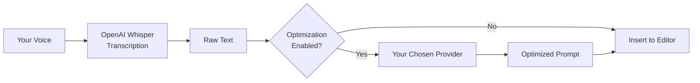

# Promptimize

> **Transform your voice into optimized prompts with AI-powered speech-to-text**

A professional VSCode/Cursor extension that captures audio from your microphone, transcribes it using OpenAI Whisper, and intelligently transforms natural speech into structured, optimized prompts ready for LLM agents.


---

## Quick Start

1. **Install** the extension (VSIX or Marketplace when available)
2. **Run Setup Wizard** — Command Palette → `Promptimize: Setup Wizard`
3. **Configure OpenAI API key** — Required for Whisper voice-to-text
4. **Optionally choose optimization provider** — OpenAI, Anthropic, Google, Azure, Ollama, OpenCode, OpenRouter, or Cursor
5. **Press `Cmd+Alt+V`** (Transcribe) or **`Cmd+Alt+P`** (Promptimize) and speak

See the full [Quick Start Guide](docs/quickstart.md) and [Recording Modes](docs/user-guide/recording-modes.md).

### Two Services, Clear Roles

| Service                 | Provider       | Required | Credentials               |
| ----------------------- | -------------- | -------- | ------------------------- |
| **Transcription**       | OpenAI Whisper | Yes      | OpenAI API key            |
| **Prompt optimization** | Your choice    | No       | Provider-specific API key |



---

## 🎯 Vision

**Eliminate the friction between thinking and coding.**

Developers often have complex architectural ideas, detailed requirements, or intricate technical explanations that are tedious to type but natural to speak. Promptimize bridges this gap by:

- **Capturing** your spoken thoughts in real-time
- **Transcribing** them with high accuracy using OpenAI Whisper
- **Transforming** natural speech into structured, technical prompts
- **Inserting** them automatically into your editor or Cursor chat

---

## 🔥 The Problem We Solve

### Before Promptimize:

```
1. Think about complex architecture requirements
2. Struggle to type everything out
3. Lose train of thought while typing
4. End up with unstructured, verbose prompts
5. LLM misunderstands due to poor formatting
```

### With Promptimize:

```
1. Press Cmd+Alt+V
2. Speak naturally about your requirements
3. Extension transcribes and optimizes automatically
4. Structured prompt appears in your editor/chat
5. LLM understands perfectly
```

---

## ✨ Features

### Current (v0.1.0)

- ✅ **Two Recording Modes** — Transcribe (raw text) and Promptimize (optimized prompts)
- ✅ **One-Click Recording** — Dual status bar buttons or keyboard shortcuts
- ✅ **High-Quality Transcription** — OpenAI Whisper API integration
- ✅ **Prompt Transformation** — AI-powered optimization via 8 providers
- ✅ **Multiple AI Providers** — OpenAI, Anthropic, Google, Azure, Ollama, OpenCode, OpenRouter, and Cursor
- ✅ **Configuration Webview** — Interactive setup panel with provider comparison and system prompt editor
- ✅ **Smart Insertion** — Chat → editor → clipboard fallback chain
- ✅ **Visual Feedback** — Status bar states and progress notifications
- ✅ **Secure Configuration** — API keys stored in VSCode SecretStorage
- ✅ **Cross-Platform** — Works on macOS, Windows, and Linux

### Coming Soon

- 🔄 **Real-time Streaming** — See transcription as you speak
- 🔄 **Custom Vocabulary UI** — Project-specific terms in configuration webview
- 🔄 **Recording History** — Review and re-use past transcriptions
- 🔄 **Planned settings** — `audioQuality`, `maxRecordingDuration`, `showNotifications` (defined but not yet applied)

---

## 🏗️ Architecture

Promptimize follows **Clean/Hexagonal Architecture** for maximum maintainability, testability, and scalability.

```
┌─────────────────────────────────────────────────────┐
│                  Presentation Layer                  │
│  (Commands, Status Bar)                              │
└────────────┬────────────────────────────────────────┘
             │
┌────────────▼────────────────────────────────────────┐
│                  Application Layer                   │
│      (Use Cases, Ports/Interfaces, DTOs)            │
└────────────┬────────────────────────────────────────┘
             │
┌────────────▼────────────────────────────────────────┐
│                    Domain Layer                      │
│    (Entities, Value Objects, Business Logic)         │
└─────────────────────────────────────────────────────┘
             │
┌────────────▼────────────────────────────────────────┐
│                Infrastructure Layer                  │
│  (OpenAI Whisper, Native Audio Capture, Config, Storage) │
└─────────────────────────────────────────────────────┘
```

See [`docs/architecture/`](docs/architecture/) for detailed architecture documentation.

---

## 🛠️ Technology Stack

### Core

- **TypeScript 5.4+** - Type-safe development
- **VSCode Extension API 1.120+** - Extension foundation
- **Node.js 22 LTS** - Runtime environment
- **Webpack 5** - Bundling and optimization

### Integrations

- **OpenAI API** - Whisper for transcription, GPT-4 for prompt transformation
- **@kstonekuan/audio-capture** - Native cross-platform microphone capture
- **VSCode SecretStorage** - Secure credential management

### Quality

- **Jest** - Unit testing
- **ESLint + Prettier** - Code quality and formatting
- **Husky** - Git hooks for pre-commit checks

---

## 📦 Installation

### From Marketplace (Coming Soon)

1. Open VSCode/Cursor
2. Go to Extensions (`Cmd+Shift+X` / `Ctrl+Shift+X`)
3. Search for "Promptimize"
4. Click Install

### Manual Installation (Current)

1. Download the latest `.vsix` file from [Releases](https://github.com/vypdev/cursor-whisper/releases)
2. Open VSCode/Cursor
3. Go to Extensions
4. Click "..." menu → "Install from VSIX..."
5. Select the downloaded file

### Upgrading from Cursor Whisper

The extension was renamed to **Promptimize** (`promptimize` publisher). If you previously installed `cursor-whisper`:

1. Uninstall the old **Cursor Whisper** extension
2. Install `promptimize-*.vsix` (or the new Marketplace listing when available)
3. Re-enter API keys (SecretStorage keys changed to `promptimize.apiKey.*`)
4. Update `settings.json`: replace `cursorWhisper.*` with `promptimize.*`
5. Update custom keybindings that reference `cursor-whisper.*` commands

---

## ⚙️ Configuration

### First-Time Setup

1. After installation, run **Promptimize: Setup Wizard** (opens automatically on first launch)
2. Enter your **OpenAI API key** — required for Whisper transcription
3. Choose whether to enable **prompt optimization** and select a provider
4. Provide provider credentials when prompted (Anthropic, Google, Azure, etc.)
5. Test your configuration with **Promptimize: Test Configuration**

**Note:** Whisper transcription always uses OpenAI. Prompt optimization is optional and can use a different provider with its own API key.

### Manual Configuration

Open Settings (`Cmd+,` / `Ctrl+,`) and search for "Promptimize":

```json
{
  "promptimize.transcriptionLanguage": "en",
  "promptimize.enablePromptTransformation": true,
  "promptimize.transformationProvider": "openai",
  "promptimize.transformationModel": "gpt-4o",
  "promptimize.audioQuality": "high",
  "promptimize.maxRecordingDuration": 120,
  "promptimize.showNotifications": true
}
```

### Transcription (Required — OpenAI Whisper)

| Setting                 | Description                                                                                          |
| ----------------------- | ---------------------------------------------------------------------------------------------------- |
| OpenAI API key          | Required for voice-to-text. Configure via **Setup Wizard** or **Configure OpenAI API Key (Whisper)** |
| `transcriptionLanguage` | Language for transcription (`en`, `es`, `auto`, etc.)                                                |

**Cost:** ~$0.006/minute of audio

### Prompt Optimization (Optional)

Prompt optimization converts transcribed speech into structured prompts. Choose a provider and supply credentials when required.

| Setting                             | Description                                                                            |
| ----------------------------------- | -------------------------------------------------------------------------------------- |
| `enablePromptTransformation`        | Enable/disable optimization                                                            |
| `transformationProvider`            | `openai`, `anthropic`, `google`, `azure`, `ollama`, `opencode`, `openrouter`, `cursor` |
| `transformationModel`               | OpenAI model (when provider is `openai`)                                               |
| `anthropicModel`                    | Claude model (when provider is `anthropic`)                                            |
| `googleModel`                       | Gemini model (when provider is `google`)                                               |
| `azureEndpoint` / `azureDeployment` | Azure OpenAI resource settings                                                         |
| `ollamaBaseUrl` / `ollamaModel`     | Local Ollama server settings                                                           |
| `openCodeBaseUrl` / `openCodeModel` | Local OpenCode proxy settings                                                          |
| `openRouterModel`                   | OpenRouter model (when provider is `openrouter`)                                       |
| `cursorModel`                       | Cursor model (when provider is `cursor`)                                               |

Use **Promptimize: Configure Prompt Optimization Provider** to set up interactively. See [`docs/configuration/`](docs/configuration/) for provider setup.

### Configuration Options

| Setting                      | Type    | Default    | Description                                                                                                              |
| ---------------------------- | ------- | ---------- | ------------------------------------------------------------------------------------------------------------------------ |
| `transcriptionLanguage`      | string  | `"auto"`   | Language for transcription (`en`, `es`, `fr`, `de`, `auto`)                                                              |
| `enablePromptTransformation` | boolean | `true`     | Transform transcription into optimized prompts                                                                           |
| `transformationProvider`     | string  | `"openai"` | LLM provider for transformation (`openai`, `anthropic`, `google`, `azure`, `ollama`, `opencode`, `openrouter`, `cursor`) |
| `transformationModel`        | string  | `"gpt-4o"` | OpenAI model for transformation                                                                                          |
| `transcriptionHint`          | string  | `""`       | Optional Whisper vocabulary hint (Settings only)                                                                         |
| `audioQuality`               | string  | `"high"`   | Planned — not yet applied (always 16 kHz mono)                                                                           |
| `maxRecordingDuration`       | number  | `120`      | Planned — not yet applied                                                                                                |
| `showNotifications`          | boolean | `true`     | Planned — not yet applied                                                                                                |

---

## 🧪 Development & Testing

### Prerequisites

- Node.js 22+ installed (via nvm; see `.nvmrc`)
- VSCode or Cursor IDE
- OpenAI API key

### Setup Development Environment

```bash
# Clone the repository
git clone https://github.com/vypdev/cursor-whisper
cd cursor-whisper

# Install dependencies (requires Node 22 — run `nvm use` first)
pnpm install

# Compile TypeScript
pnpm run compile
```

### Debug the Extension

1. Open the project in VSCode/Cursor
2. Press `F5` to start debugging
3. A new "Extension Development Host" window will open
4. The extension will be loaded in this window

### Configure API Key

1. In the Extension Development Host window:
   - Open Command Palette (`Cmd/Ctrl+Shift+P`)
   - Type: "Promptimize: Configure API Key"
   - Paste your OpenAI API key (starts with `sk-...`)
   - The key is securely stored in your system's Keychain/Credential Manager

### Test the Extension

1. **Start Recording**:
   - Press `Cmd/Ctrl+Alt+V` (or click "Voice" in the status bar)
   - Recording starts immediately in the background

2. **Record Audio**:
   - Speak clearly into your microphone
   - Ensure Cursor has microphone access in System Settings (macOS) or Privacy settings (Windows)

3. **Stop Recording**:
   - Press the stop command or status bar action when done

4. **Wait for Processing**:
   - Audio is transcribed (~5-10 seconds)
   - Text is optimized with GPT-4 (optional)
   - Text is automatically inserted into the active editor

5. **Check Status**:
   - Status bar shows current state
   - Notifications show progress and errors

### Build Status

```bash
# Compile TypeScript
pnpm run compile

# Run linter
pnpm run lint

# Run tests (when available)
pnpm test

# Package extension (includes all platform native binaries)
pnpm run package

# Verify VSIX contains all platform binaries
pnpm run package:verify
```

### Packaging for Distribution

To create a VSIX that works across all platforms (macOS, Linux, Windows):

```bash
pnpm run package
```

This will:

1. Install all platform-specific native binaries (`darwin-arm64`, `darwin-x64`, `linux-x64-gnu`, `win32-x64-msvc`)
2. Bundle them into the VSIX (~2.5MB total)
3. Create `promptimize-X.X.X.vsix`

To verify all binaries are included:

```bash
pnpm run package:verify
```

Expected output:

- `audio-capture-darwin-arm64`
- `audio-capture-darwin-x64`
- `audio-capture-linux-x64-gnu`
- `audio-capture-win32-x64-msvc`

**Current Build**: ✅ SUCCESS (577 KB bundle)

---

## 🚀 Usage

### Recording Modes

Promptimize has two modes — see [Recording Modes](docs/user-guide/recording-modes.md) for full details.

| Mode            | Shortcut         | Output                      |
| --------------- | ---------------- | --------------------------- |
| **Transcribe**  | `Cmd/Ctrl+Alt+V` | Raw Whisper transcription   |
| **Promptimize** | `Cmd/Ctrl+Alt+P` | Optimized structured prompt |

### Quick Start

1. **Open your editor or Cursor chat**
2. **Press `Cmd+Alt+V`** (Transcribe) or **`Cmd+Alt+P`** (Promptimize)
3. **Speak naturally about your requirements**
4. **Click the status bar** (Recording...) to stop
5. **Transcribed or optimized text appears automatically**

### Status Bar

Three items appear in the status bar (right side):

| Item            | Idle                   | Recording                              |
| --------------- | ---------------------- | -------------------------------------- |
| **Transcribe**  | $(mic) Transcribe      | $(record) Recording... (click to stop) |
| **Promptimize** | $(sparkle) Promptimize | $(record) Recording... (click to stop) |
| **Settings**    | $(gear) Settings       | Available during recording             |

During processing, progress appears in **notifications** (Transcribing..., Optimizing..., Inserting...).

### Example Workflow

**Spoken Input:**

> "I need to refactor the authentication service to support JWT tokens instead of sessions. We should maintain backward compatibility with existing session-based auth for 6 months. Also need unit tests for the new JWT validation logic and integration tests for the auth flow."

**Optimized Output:**

```markdown
## Refactor Authentication Service to JWT

### Context

- Current implementation: session-based authentication
- Target implementation: JWT tokens

### Objectives

1. Implement JWT token generation and validation
2. Maintain backward compatibility with session-based auth
3. Provide 6-month deprecation period for sessions

### Technical Requirements

- JWT library integration
- Token validation middleware
- Session-to-JWT migration path

### Testing Requirements

- Unit tests for JWT validation logic
- Integration tests for complete auth flow
- Backward compatibility tests for sessions

### Timeline

- 6-month deprecation period for session-based auth
```

---

## 🎨 User Experience

### Visual States

The status bar reflects recorder states; fine-grained progress (Transcribing, Optimizing) appears in notifications.

| State          | Status Bar                                 | Description                        |
| -------------- | ------------------------------------------ | ---------------------------------- |
| **Idle**       | $(mic) Transcribe / $(sparkle) Promptimize | Ready to record                    |
| **Recording**  | $(record) Recording...                     | Actively recording (click to stop) |
| **Processing** | $(sync~spin) Processing...                 | Preparing audio after stop         |
| **Error**      | Error styling                              | Something went wrong               |

See [UX States](docs/ux/states.md) for the full state reference.

### Keyboard Shortcuts

| Shortcut                   | Action                             |
| -------------------------- | ---------------------------------- |
| `Cmd+Alt+V` / `Ctrl+Alt+V` | Start Transcribe recording         |
| `Cmd+Alt+P` / `Ctrl+Alt+P` | Start Promptimize recording        |
| `Escape`                   | Cancel recording (while recording) |

Shortcuts **start** recording only — stop by clicking the status bar. See [Keyboard Shortcuts](docs/user-guide/keyboard-shortcuts.md).

### Commands (Command Palette)

| Command                                               | Purpose                           |
| ----------------------------------------------------- | --------------------------------- |
| `Promptimize: Start Transcribe Recording`             | Start raw transcription           |
| `Promptimize: Stop Transcribe Recording`              | Stop and process Transcribe       |
| `Promptimize: Start Promptimize Recording`            | Start optimized prompt            |
| `Promptimize: Stop Promptimize Recording`             | Stop and process Promptimize      |
| `Promptimize: Cancel Recording`                       | Discard recording                 |
| `Promptimize: Open Configuration`                     | Configuration webview             |
| `Promptimize: Configure OpenAI API Key (Whisper)`     | Set Whisper API key               |
| `Promptimize: Configure Prompt Optimization Provider` | Provider setup wizard             |
| `Promptimize: Configure OpenAI Optimization Model`    | Pick GPT model (OpenAI only)      |
| `Promptimize: Test Configuration`                     | Test setup; opens results webview |
| `Promptimize: Setup Wizard`                           | Opens configuration panel         |

**Deprecated:** `(Deprecated) Start Recording` and `(Deprecated) Stop Recording` — use mode-specific commands instead.

---

## 🔒 Security & Privacy

### Data Handling

- **Audio files are temporary** - Deleted immediately after transcription
- **No local storage** - Audio is never written to disk
- **API keys are encrypted** - Stored in VSCode SecretStorage
- **No telemetry** - Zero analytics or usage tracking
- **HTTPS only** - All API calls are encrypted

### API Key Security

Your OpenAI API key is:

1. Stored in VSCode's secure credential storage (SecretStorage)
2. Never exposed in logs or error messages
3. Never sent anywhere except OpenAI's official API
4. Accessible only by this extension

### Microphone Permissions

The extension requests microphone access:

- **macOS**: System Settings → Privacy & Security → Microphone
- **Windows**: Settings → Privacy → Microphone
- **Linux**: System-dependent, usually automatic

---

## 🏗️ Development

### Prerequisites

- **Node.js 22+** (via [nvm](https://github.com/nvm-sh/nvm); see `.nvmrc`)
- **pnpm**
- **VSCode 1.120+** for testing

### Setup

```bash
# Clone the repository
git clone https://github.com/vypdev/cursor-whisper.git
cd cursor-whisper

# Install dependencies (requires Node 22 — run `nvm use` first)
pnpm install

# Build the extension
pnpm run compile

# Run tests
pnpm test

# Watch mode for development
pnpm run watch
```

### Project Structure

```
promptimize/
├── src/
│   ├── application/     # Use cases and ports
│   ├── domain/          # Business entities
│   ├── infrastructure/  # External integrations
│   ├── presentation/    # UI and commands
│   ├── shared/          # Utilities and constants
│   └── extension.ts     # Entry point
├── docs/                # Comprehensive documentation
├── test/                # Unit and integration tests
└── package.json
```

See [`docs/architecture/`](docs/architecture/) for detailed structure documentation.

### Running Locally

1. Open the project in VSCode
2. Press `F5` to launch Extension Development Host
3. The extension will be active in the new window
4. Test recording with `Cmd+Alt+V`

---

## 🧪 Testing

Automated tests cover use cases, transformers, and UI components — see [`docs/testing/strategy.md`](docs/testing/strategy.md).

### Run Tests

```bash
source scripts/ensure-node.sh && pnpm test
```

### Test Strategy

- **Unit tests**: Use cases and adapters with mocked ports (priority)
- **Manual smoke tests**: Real recording → transcription → insertion before release

See [`docs/testing/strategy.md`](docs/testing/strategy.md) for critical test priorities and manual checklist.

---

## 📈 Roadmap

### v0.1.0 (Current)

- ✅ Dual recording modes (Transcribe + Promptimize)
- ✅ Whisper transcription
- ✅ Prompt transformation (8 providers)
- ✅ Configuration webview
- ✅ Chat / editor / clipboard insertion
- ✅ API key configuration

### v0.2.0 (Next)

- 🔄 Apply planned settings (`audioQuality`, `maxRecordingDuration`, `showNotifications`)
- 🔄 Transformation preview before insert
- 🔄 Transcription language in configuration webview

### v0.3.0

- 🔄 Context-aware insertion improvements
- 🔄 Push-to-talk mode

### v0.4.0

- 🔄 Real-time streaming transcription
- 🔄 Recording history
- 🔄 Edit before insert

### v0.5.0

- 🔄 Custom vocabulary UI
- 🔄 Technical term correction

### v1.0.0 (Stable)

- 🔄 Full production release
- 🔄 Performance optimization
- 🔄 Extensive testing

See [`PROGRESS.md`](PROGRESS.md) for current project status.

---

## 🤝 Contributing

We welcome contributions! See [`docs/standards/coding-conventions.md`](docs/standards/coding-conventions.md) for coding standards and development workflow.

### Development Philosophy

1. **Clean Architecture** - Maintain clear layer separation
2. **Type Safety** - Strong TypeScript typing everywhere
3. **Testability** - Write testable, pure functions
4. **Documentation** - Document decisions and complex logic
5. **User Experience** - Prioritize UX over technical complexity

---

## 📝 Philosophy & Design Principles

### Core Principles

1. **Compatibility First** - Real-world compatibility over theoretical solutions
2. **User Experience** - Minimal friction, maximum productivity
3. **Maintainability** - Clean code over clever hacks
4. **Scalability** - Built to grow and evolve
5. **Privacy** - User data never leaves their control

### Why Clean Architecture?

- **Testability**: Business logic independent of frameworks
- **Flexibility**: Easy to swap implementations (e.g., different STT providers)
- **Maintainability**: Clear responsibilities and boundaries
- **Scalability**: Add features without breaking existing code

### Why Dependency Injection?

- **Testability**: Easy to mock dependencies
- **Flexibility**: Configure different implementations
- **Maintainability**: Clear dependency graph

---

## 🐛 Troubleshooting

See the full [Troubleshooting Guide](docs/user-guide/troubleshooting.md) with decision trees.

### Microphone not working

**macOS:**

1. Go to System Settings → Privacy & Security → Microphone
2. Ensure VSCode/Cursor is enabled

**Windows:**

1. Go to Settings → Privacy → Microphone
2. Ensure VSCode/Cursor has permission

**Linux:**

- Permissions are usually automatic
- Check `pavucontrol` if using PulseAudio

### Transcription fails

- Verify your OpenAI API key is valid
- Check you have credits in your OpenAI account
- Ensure audio duration is between 0.1s and 5 minutes
- Check file size doesn't exceed 25MB

### Text not inserting

- Ensure you have an active editor or chat input focused
- Check the status bar for error messages
- Try manually pasting from clipboard (fallback behavior)

### Cursor Agents Window issues

Promptimize works best in:

- **Classic Mode** (`cursor --classic`)
- **Editor Window**

### Debug output and privacy

Transcriptions and optimized prompts are **never written to logs**. For troubleshooting, use the status bar, progress notifications, and error dialogs. Enable the **Promptimize** output channel only for operational messages (timestamps, durations, error types)—not user speech content.

MIT License - see [LICENSE](LICENSE) file for details.

---

## 🙏 Acknowledgments

- **OpenAI** - Whisper and GPT-4 APIs
- **VSCode Team** - Excellent extension API and documentation
- **Cursor Team** - Innovation in AI-powered development

---

## 📬 Contact & Support

- **Issues**: [GitHub Issues](https://github.com/vypdev/cursor-whisper/issues)
- **Discussions**: [GitHub Discussions](https://github.com/vypdev/cursor-whisper/discussions)
- **Email**: support@cursor-whisper.dev

---

## 🔗 Links

- [Documentation](docs/)
- [Recording Modes](docs/user-guide/recording-modes.md)
- [Configuration Webview Guide](docs/configuration/webview-guide.md)
- [Architecture Docs](docs/architecture/)
- [Configuration Guide](docs/configuration/)
- [Troubleshooting](docs/user-guide/troubleshooting.md)
- [Project Progress](PROGRESS.md)

---

**Made with ❤️ for developers who think faster than they type**
