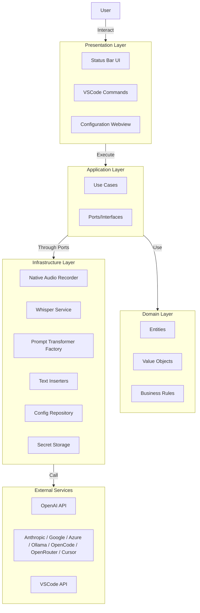
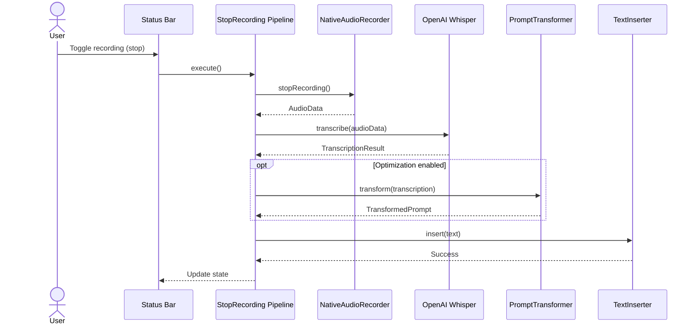

# Architecture Overview

**Last Updated**: 2026-05-24

---

## System Overview

Cursor Whisper is a VSCode/Cursor extension that:

1. **Captures audio** via native `@kstonekuan/audio-capture`
2. **Transcribes** with OpenAI Whisper (always required)
3. **Transforms** transcribed speech into structured prompts via a configurable provider ([ADR-0014](../adr/0014-multiple-transformation-providers.md))
4. **Inserts** the result into the editor, chat, or clipboard

For setup and provider selection, see the [Configuration Guide](../configuration/README.md).

### High-Level Architecture



---

## Architectural Style

Cursor Whisper follows **Clean/Hexagonal Architecture** (ports and adapters). Rationale and alternatives are documented in [ADR-0002](../adr/0002-clean-architecture.md).

**Why this matters for this project:**
- Multiple external integrations (Whisper, several LLM providers, VSCode APIs, native audio)
- Swappable transformation providers without changing use cases
- Business logic testable with mocked ports

---

## Layer Architecture

```
Presentation ──→ Application ──→ Domain
                      ▲
Infrastructure ───────┘
```

| Layer | Location | Responsibility |
|-------|----------|----------------|
| **Domain** | [`src/domain/`](../../src/domain/) | Entities, value objects, domain errors — no framework imports |
| **Application** | [`src/application/`](../../src/application/) | Use cases, port interfaces, DTOs |
| **Infrastructure** | [`src/infrastructure/`](../../src/infrastructure/) | Port implementations (audio, Whisper, transformers, config, storage) |
| **Presentation** | [`src/presentation/`](../../src/presentation/) | Commands, status bar, configuration webview |

**Dependency rule:** Inner layers never depend on outer layers. Presentation orchestrates use cases; it does not call infrastructure directly.

---

## Component Diagram

```mermaid
graph TB
    subgraph Presentation["Presentation Layer"]
        CMD[Commands]
        SB[StatusBarItem]
        CFG[ConfigurationPanel]
    end

    subgraph Application["Application Layer"]
        UC1[StartRecordingUseCase]
        UC2[StopRecordingUseCase]
        UC3[TranscribeAudioUseCase]
        UC4[TransformPromptUseCase]
        UC5[InsertTextUseCase]

        PORT1[IAudioRecorder]
        PORT2[ITranscriptionService]
        PORT3[IPromptTransformer]
        PORT4[ITextInserter]
        PORT5[IConfigRepository]
    end

    subgraph Infrastructure["Infrastructure Layer"]
        AUDIO[NativeAudioRecorder]
        WHISPER[OpenAIWhisperService]
        FACTORY[PromptTransformerFactory]
        GPT[OpenAIPromptTransformer]
        CLAUDE[AnthropicPromptTransformer]
        GEMINI[GooglePromptTransformer]
        AZURE[AzureOpenAIPromptTransformer]
        OLLAMA[OllamaPromptTransformer]
        OPENCODE[OpenCodePromptTransformer]
        OPENROUTER[OpenRouterPromptTransformer]
        CURSOR[CursorPromptTransformer]
        INSERT1[ChatParticipantInserter]
        INSERT2[EditorTextInserter]
        INSERT3[FallbackTextInserter]
        CONFIG[VSCodeConfigRepository]
    end

    CMD --> UC1
    CMD --> UC2
    SB --> CMD
    CFG --> CONFIG

    UC1 --> PORT1
    UC3 --> PORT2
    UC4 --> PORT3
    UC5 --> PORT4

    AUDIO --> PORT1
    WHISPER --> PORT2
    FACTORY --> GPT
    FACTORY --> CLAUDE
    FACTORY --> GEMINI
    FACTORY --> AZURE
    FACTORY --> OLLAMA
    FACTORY --> OPENCODE
    FACTORY --> OPENROUTER
    FACTORY --> CURSOR
    GPT --> PORT3
    CLAUDE --> PORT3
    GEMINI --> PORT3
    AZURE --> PORT3
    OLLAMA --> PORT3
    OPENCODE --> PORT3
    OPENROUTER --> PORT3
    CURSOR --> PORT3
    INSERT1 --> PORT4
    INSERT2 --> PORT4
    INSERT3 --> PORT4
    CONFIG --> PORT5
```



---

## Data Flow

End-to-end recording flow with error branches: see [Complete Flow](../flows/complete-flow.md).



---

## Technology Stack

| Component | Technology | Purpose |
|-----------|-----------|---------|
| Language | TypeScript 5.4+ | Type-safe development |
| Runtime | Node.js 22 LTS | Extension host |
| Framework | VSCode Extension API 1.120+ | Extension foundation |
| Bundler | Webpack 5 | Module bundling |
| Audio | @kstonekuan/audio-capture | Native microphone capture |
| Transcription | OpenAI Whisper | Speech-to-text |
| Transformation | OpenAI, Anthropic, Google, Azure, Ollama, OpenCode, OpenRouter, Cursor | Prompt optimization |
| Testing | Jest | Unit and integration tests |

Technology decisions: [ADR-0001](../adr/0001-use-typescript.md), [ADR-0013](../adr/0013-native-audio-capture.md).

---

## Design Patterns

| Pattern | Where | ADR |
|---------|-------|-----|
| Clean Architecture | Layer structure | [0002](../adr/0002-clean-architecture.md) |
| Dependency Injection | Constructor injection in use cases | [0004](../adr/0004-dependency-injection.md) |
| Chain of Responsibility | Text insertion (chat → editor → clipboard) | [0006](../adr/0006-text-insertion-strategy.md) |
| Strategy / Factory | Swappable prompt transformers | [0014](../adr/0014-multiple-transformation-providers.md) |
| Adapter | Infrastructure wraps external APIs | — |
| Repository | Configuration access abstraction | — |

---

## Source Code Map

| Concern | Start here |
|---------|------------|
| Entry point & DI wiring | [`src/extension.ts`](../../src/extension.ts) |
| Use cases | [`src/application/use-cases/`](../../src/application/use-cases/) |
| Port interfaces | [`src/application/ports/`](../../src/application/ports/) |
| Domain model | [`src/domain/`](../../src/domain/) |
| External integrations | [`src/infrastructure/`](../../src/infrastructure/) |
| UI & commands | [`src/presentation/`](../../src/presentation/) |

---

**Related:** [Complete Flow](../flows/complete-flow.md) · [ADRs](../adr/) · [Testing Strategy](../testing/strategy.md)
