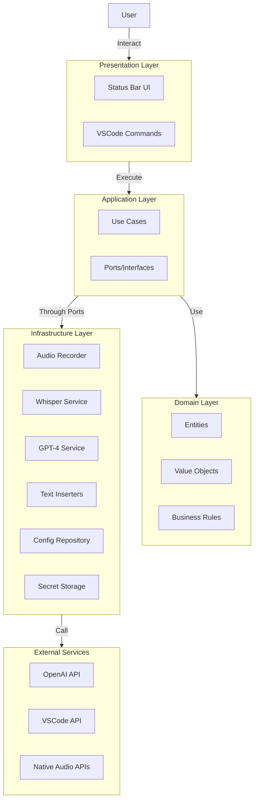
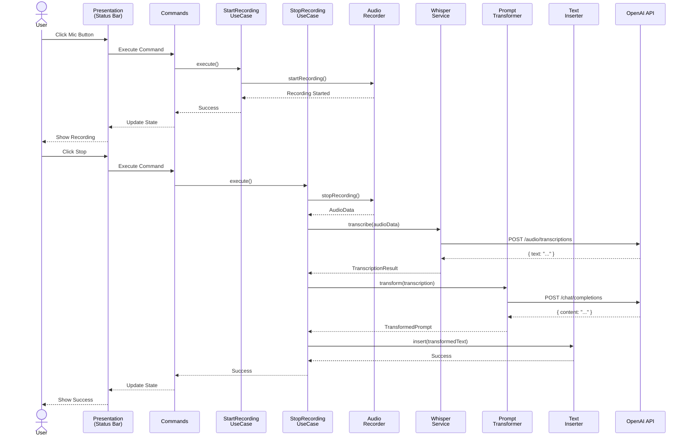
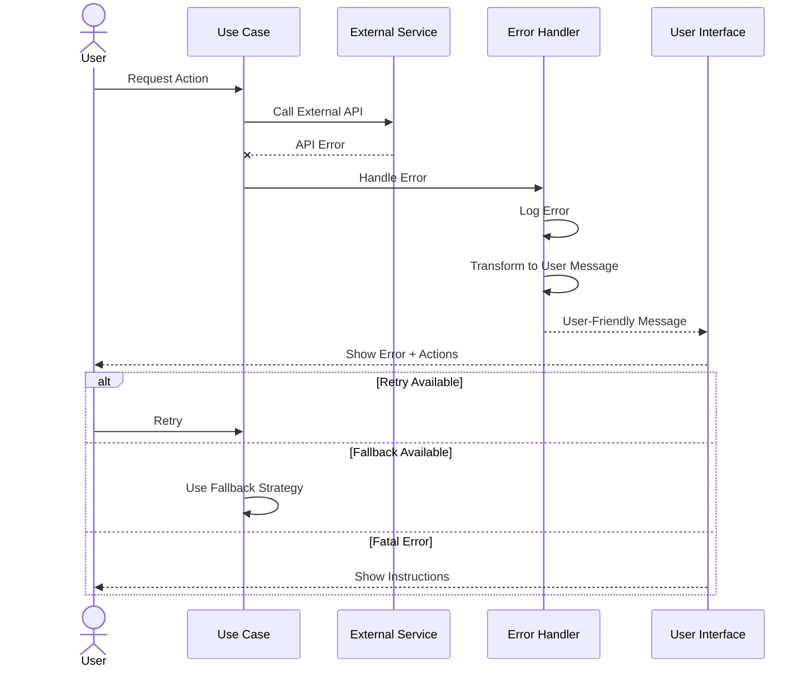

# Architecture Overview

**Last Updated**: 2026-05-23

---

## Table of Contents

1. [System Overview](#system-overview)
2. [Architectural Style](#architectural-style)
3. [Layer Architecture](#layer-architecture)
4. [Component Diagram](#component-diagram)
5. [Dependency Rules](#dependency-rules)
6. [Data Flow](#data-flow)
7. [Technology Stack](#technology-stack)
8. [Design Patterns](#design-patterns)

---

## System Overview

Cursor Whisper is a VSCode/Cursor extension that transforms voice into optimized prompts through:

1. **Audio Capture** - Record user speech via native `@kstonekuan/audio-capture`
2. **Transcription** - Convert audio to text using OpenAI Whisper
3. **Transformation** - Optimize text into structured prompts using GPT-4
4. **Insertion** - Insert result into editor or chat intelligently

### High-Level Architecture



---

## Architectural Style

### Clean/Hexagonal Architecture

Cursor Whisper follows **Clean Architecture** (also known as Hexagonal Architecture or Ports & Adapters):

**Core Principles**:
1. **Independence**: Business logic independent of frameworks
2. **Testability**: Core logic testable without external dependencies
3. **Flexibility**: Easy to swap implementations
4. **Maintainability**: Clear separation of concerns

**Why This Architecture?**
- Extension will evolve significantly (MVP → v1.0+)
- Multiple integration points (OpenAI, VSCode, Audio, etc.)
- Need to support alternative providers in future
- High testability requirement
- Team unfamiliar with codebase needs clear structure

See [ADR-0002](../adr/0002-clean-architecture.md) for detailed rationale.

---

## Layer Architecture

### The Four Layers

```
┌─────────────────────────────────────────────┐
│          Presentation Layer                 │
│  Commands, UI, Status Bar                   │
└────────────┬────────────────────────────────┘
             │ depends on
             ▼
┌─────────────────────────────────────────────┐
│          Application Layer                  │
│  Use Cases, Ports (Interfaces), DTOs        │
└────────────┬────────────────────────────────┘
             │ depends on
             ▼
┌─────────────────────────────────────────────┐
│            Domain Layer                     │
│  Entities, Value Objects, Business Logic    │
└─────────────────────────────────────────────┘
             ▲
             │ implemented by
             │
┌────────────┴────────────────────────────────┐
│        Infrastructure Layer                 │
│  Adapters, External Service Integrations    │
└─────────────────────────────────────────────┘
```

### 1. Domain Layer

**Purpose**: Pure business logic, no external dependencies

**Contains**:
- **Entities**: Core business objects (`Recording`, `Transcription`, `Prompt`)
- **Value Objects**: Immutable values (`AudioFormat`, `RecordingState`, `ApiKey`)
- **Business Rules**: Core validation and logic
- **Domain Errors**: Business exception types

**Rules**:
- NO imports from other layers
- NO framework dependencies
- Pure TypeScript/JavaScript
- Fully unit testable

**Example**:
```typescript
// domain/entities/Recording.ts
export class Recording {
  constructor(
    public readonly id: string,
    public readonly audioData: AudioData,
    public readonly timestamp: Date,
    public readonly duration: number
  ) {
    if (duration <= 0) {
      throw new InvalidRecordingError('Duration must be positive');
    }
  }

  isLongRecording(): boolean {
    return this.duration > 60; // 60 seconds
  }
}
```

### 2. Application Layer

**Purpose**: Orchestrate business logic, define contracts

**Contains**:
- **Use Cases**: Application-specific business operations
- **Ports (Interfaces)**: Contracts for external dependencies
- **DTOs**: Data transfer objects for layer communication

**Rules**:
- Can import from Domain layer
- CANNOT import from Infrastructure or Presentation
- Depends on abstractions (ports), not implementations
- Framework-agnostic

**Example**:
```typescript
// application/use-cases/StartRecordingUseCase.ts
export class StartRecordingUseCase {
  constructor(
    private audioRecorder: IAudioRecorder,      // Port
    private configRepo: IConfigRepository,      // Port
    private logger: ILogger                     // Port
  ) {}

  async execute(): Promise<void> {
    const config = await this.configRepo.getConfig();
    
    if (!config.apiKey) {
      throw new ConfigError('API key not configured');
    }

    await this.audioRecorder.startRecording();
  }
}
```

### 3. Infrastructure Layer

**Purpose**: Implement ports, integrate with external systems

**Contains**:
- **Adapters**: Implementations of application ports
- **External Service Clients**: OpenAI, VSCode API wrappers
- **Repositories**: Configuration, storage implementations
- **Utilities**: File management, logging

**Rules**:
- Can import from Application and Domain
- Implements ports defined in Application
- Contains framework/library dependencies
- Isolated from Presentation

**Example**:
```typescript
// infrastructure/transcription/OpenAIWhisperService.ts
export class OpenAIWhisperService implements ITranscriptionService {
  private client: OpenAI;

  constructor(
    private secretStorage: SecretStorage,
    private logger: ILogger
  ) {
    this.initializeClient();
  }

  async transcribe(audio: AudioData): Promise<TranscriptionResult> {
    // Implementation using OpenAI SDK
  }
}
```

### 4. Presentation Layer

**Purpose**: User interface and VSCode integration

**Contains**:
- **Commands**: VSCode command handlers
- **Status Bar**: Status bar item and updates
- **State Management**: UI state coordination

**Rules**:
- Can import from Application and Domain
- Orchestrates use case execution
- Handles VSCode-specific APIs
- Contains VSCode-specific APIs

**Example**:
```typescript
// presentation/commands/StartRecordingCommand.ts
export function registerStartRecordingCommand(
  context: vscode.ExtensionContext,
  useCase: StartRecordingUseCase
): vscode.Disposable {
  return vscode.commands.registerCommand(
    'cursor-whisper.startRecording',
    async () => {
      try {
        await useCase.execute();
        vscode.window.showInformationMessage('Recording started');
      } catch (error) {
        vscode.window.showErrorMessage(`Failed: ${error.message}`);
      }
    }
  );
}
```

---

## Component Diagram

### Complete Component View

```mermaid
graph TB
    subgraph Presentation["🎨 Presentation Layer"]
        CMD[Commands]
        SB[StatusBarItem]
        STATE[StateManager]
    end

    subgraph Application["🔧 Application Layer"]
        UC1[StartRecordingUseCase]
        UC2[StopRecordingUseCase]
        UC3[TranscribeAudioUseCase]
        UC4[TransformPromptUseCase]
        UC5[InsertTextUseCase]
        
        PORT1[IAudioRecorder]
        PORT2[ITranscriptionService]
        PORT3[IPromptTransformer]
        PORT4[ITextInserter]
        PORT5[IConfigRepository]
    end

    subgraph Domain["💎 Domain Layer"]
        ENT1[Recording]
        ENT2[Transcription]
        ENT3[Prompt]
        VO1[AudioFormat]
        VO2[RecordingState]
        VO3[ApiKey]
    end

    subgraph Infrastructure["⚙️ Infrastructure Layer"]
        AUDIO[NativeAudioRecorder]
        WHISPER[OpenAIWhisperService]
        GPT[OpenAIPromptTransformer]
        INSERT1[ChatParticipantInserter]
        INSERT2[EditorTextInserter]
        INSERT3[FallbackTextInserter]
        CONFIG[VSCodeConfigRepository]
        SECRET[SecretStorage]
    end

    CMD -->|executes| UC1
    CMD -->|executes| UC2
    SB -->|observes| STATE
    WV -->|sends messages| CMD

    UC1 -->|uses| PORT1
    UC2 -->|uses| PORT1
    UC2 -->|uses| UC3
    UC3 -->|uses| PORT2
    UC4 -->|uses| PORT3
    UC5 -->|uses| PORT4

    UC1 -->|creates| ENT1
    UC3 -->|creates| ENT2
    UC4 -->|creates| ENT3

    AUDIO -->|implements| PORT1
    WHISPER -->|implements| PORT2
    GPT -->|implements| PORT3
    INSERT1 -->|implements| PORT4
    INSERT2 -->|implements| PORT4
    INSERT3 -->|implements| PORT4
    CONFIG -->|implements| PORT5
```



---

## Dependency Rules

### The Dependency Rule

**Dependencies point inward**. Inner layers NEVER depend on outer layers.

```
Presentation ──→ Application ──→ Domain
                      ▲
Infrastructure ───────┘
```

### What Each Layer Can Import

| Layer | Can Import From | Cannot Import From |
|-------|----------------|-------------------|
| Domain | Nothing | Everything |
| Application | Domain | Infrastructure, Presentation |
| Infrastructure | Application, Domain | Presentation |
| Presentation | Application, Domain | Infrastructure (directly) |

### Why This Matters

1. **Domain stays pure**: Business logic has no framework coupling
2. **Application is portable**: Use cases work anywhere
3. **Infrastructure is swappable**: Change OpenAI to Google without touching business logic
4. **Presentation is replaceable**: Could build CLI, web UI, etc.

### Enforcing Dependencies

Use ESLint rules to enforce:

```javascript
// .eslintrc.js
module.exports = {
  rules: {
    'no-restricted-imports': ['error', {
      patterns: [
        {
          group: ['**/infrastructure/**'],
          message: 'Domain and Application cannot import Infrastructure'
        },
        {
          group: ['**/presentation/**'],
          message: 'Domain, Application, and Infrastructure cannot import Presentation'
        }
      ]
    }]
  }
};
```

---

## Data Flow

### Complete Recording Flow



### Error Flow



---

## Technology Stack

### Core Technologies

| Component | Technology | Version | Purpose |
|-----------|-----------|---------|---------|
| Language | TypeScript | 5.4+ | Type-safe development |
| Runtime | Node.js | 20 LTS | Extension host |
| Framework | VSCode Extension API | 1.120+ | Extension foundation |
| Bundler | Webpack | 5.x | Module bundling |
| Audio Capture | @kstonekuan/audio-capture | 0.0.3+ | Native microphone capture |

### External Services

| Service | Purpose | Cost |
|---------|---------|------|
| OpenAI Whisper | Audio transcription | $0.006/minute |
| OpenAI GPT-4o | Prompt transformation | $15/1M tokens |

### Development Tools

| Tool | Purpose |
|------|---------|
| Jest | Unit testing |
| @vscode/test-electron | Integration testing |
| ESLint | Code linting |
| Prettier | Code formatting |
| Husky | Git hooks |

See [ADR-0001](../adr/0001-use-typescript.md) for technology decisions.

---

## Design Patterns

### Patterns Used

1. **Clean Architecture** (overall structure)
   - Separation of concerns
   - Dependency inversion
   - See [ADR-0002](../adr/0002-clean-architecture.md)

2. **Dependency Injection** (throughout)
   - Constructor injection
   - Manual wiring in composition root
   - See [ADR-0004](../adr/0004-dependency-injection.md)

3. **Chain of Responsibility** (text insertion)
   - Multiple insertion strategies
   - Automatic fallback
   - See [ADR-0006](../adr/0006-text-insertion-strategy.md)

4. **Adapter Pattern** (infrastructure)
   - Wrap external APIs
   - Implement application ports
   - Isolate external dependencies

5. **Strategy Pattern** (multiple implementations)
   - Different audio recorders
   - Different text inserters
   - Swappable at runtime

6. **Observer Pattern** (state management)
   - UI observes state changes
   - Reactive updates
   - Event-driven architecture

7. **Repository Pattern** (configuration)
   - Abstract configuration access
   - Consistent interface
   - Easy to test

8. **Factory Pattern** (object creation)
   - Complex object construction
   - Composition root
   - Dependency wiring

### Pattern Benefits

- **Maintainability**: Clear structure, easy to modify
- **Testability**: Each component testable in isolation
- **Flexibility**: Easy to add new implementations
- **Scalability**: Patterns support growth
- **Understandability**: Standard patterns are familiar

---

## Next Steps

For more detailed documentation, see:

- [Domain Layer](../domain/README.md)
- [Application Layer](../application/README.md)
- [Infrastructure Layer](../infrastructure/README.md)
- [Presentation Layer](../presentation/README.md)
- [API Reference](../api/README.md)

---

**This architecture is designed to last and evolve from MVP through v1.0 and beyond.**
