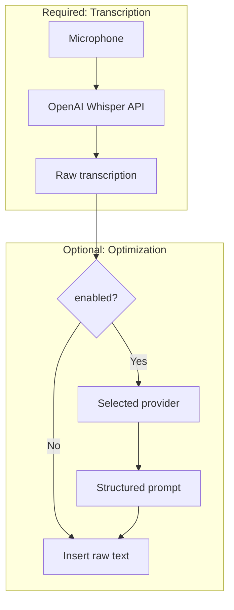

# Configuration Guide

Complete reference for installing, configuring, and using Promptimize.

---

## Service Architecture

Promptimize uses two independent AI services:

| Service | Provider | Required | Credentials |
|---------|----------|----------|-------------|
| **Transcription** | OpenAI Whisper | Yes | OpenAI API key |
| **Prompt optimization** | User choice | No | Provider-specific (see below) |



---

## Step 1: OpenAI API Key (Whisper)

**Always required** for voice-to-text.

1. Create a key at https://platform.openai.com/api-keys
2. Run **Promptimize: Configure OpenAI API Key (Whisper)** or use the setup wizard
3. Paste your key (stored securely in VSCode SecretStorage)

**Cost:** ~$0.006 per minute of audio

The same OpenAI key can be reused for OpenAI prompt optimization (Step 2, Option A).

---

## Step 2: Prompt Optimization (Optional)

Enable in settings: `promptimize.enablePromptTransformation`

Or run **Promptimize: Configure Prompt Optimization Provider**.

### Provider comparison

| Provider | Cost/Transform* | Speed | Privacy | Quality | Best For |
|----------|-----------------|-------|---------|---------|----------|
| OpenAI GPT-4o | ~$0.01 | Fast | Cloud | High | General use; reuse Whisper key |
| Anthropic Claude | ~$0.01–0.02 | Fast | Cloud | Very High | Complex reasoning |
| Google Gemini | ~$0.001 | Very Fast | Cloud | Good | Cost-sensitive usage |
| Azure OpenAI | Varies | Fast | Private Cloud | High | Enterprise deployments |
| Ollama | Free | Medium | Local | Good | Privacy-first, offline |
| OpenCode | Free | Medium | Local | High | Reuse OpenCode multi-provider setup |
| OpenRouter | Varies | Fast | Cloud | High | 200+ models with one API key |
| Cursor | ~$0.01 | Fast | Cloud | High | Cursor Composer and frontier models with one API key |

\*Plus Whisper transcription cost (~$0.006/min, always OpenAI)

API keys are stored per provider (`promptimize.apiKey.{provider}`). Switching providers does not delete saved keys.

---

### Option A: OpenAI (default)

```json
{
  "promptimize.enablePromptTransformation": true,
  "promptimize.transformationProvider": "openai",
  "promptimize.transformationModel": "gpt-4o"
}
```

**Setup:** Get a key from [OpenAI Platform](https://platform.openai.com/api-keys). Run the setup wizard or **Configure Prompt Optimization Provider** and select OpenAI. The same key used for Whisper works for optimization.

**Recommended models:** `gpt-4o` (default), `gpt-4o-mini`, `gpt-4-turbo`

**Pitfalls:** Keys must start with `sk-`. Whisper and GPT share the same OpenAI account balance. Whisper key is required even if you use another provider for optimization.

---

### Option B: Anthropic

```json
{
  "promptimize.transformationProvider": "anthropic",
  "promptimize.anthropicModel": "claude-3-5-sonnet-20241022"
}
```

**Setup:** Configure OpenAI for Whisper first. Get an Anthropic key from [Anthropic Console](https://console.anthropic.com/). Run **Configure Prompt Optimization Provider**, select Anthropic, and enter your key.

**Recommended models:** `claude-3-5-sonnet-20241022` (default), `claude-3-5-haiku-20241022`, `claude-3-opus-20240229`

**Pitfalls:** Anthropic only handles optimization — Whisper still needs OpenAI. Use Anthropic keys from console.anthropic.com, not OpenAI keys.

---

### Option C: Google Gemini

```json
{
  "promptimize.transformationProvider": "google",
  "promptimize.googleModel": "gemini-1.5-pro"
}
```

**Setup:** Configure OpenAI for Whisper first. Get a key from [Google AI Studio](https://aistudio.google.com/app/apikey). Run **Configure Prompt Optimization Provider**, select Google Gemini, and enter your key.

**Recommended models:** `gemini-1.5-pro`, `gemini-1.5-flash`, `gemini-2.0-flash`

**Pitfalls:** Gemini only handles optimization. Use Google AI Studio keys, not GCP service account keys unless configured for the Generative Language API.

---

### Option D: Azure OpenAI

```json
{
  "promptimize.transformationProvider": "azure",
  "promptimize.azureEndpoint": "https://my-resource.openai.azure.com",
  "promptimize.azureDeployment": "gpt-4o-deployment"
}
```

**Setup:** Configure OpenAI for Whisper first. Create an Azure OpenAI resource and deploy a chat model. Run **Configure Prompt Optimization Provider**, select Azure OpenAI, and enter your Azure API key, endpoint URL, and deployment name.

**Notes:** The **deployment name** (not the model name) is used for API calls. Endpoint should be the resource URL without a trailing slash. Azure API key is stored separately from your OpenAI Whisper key.

**Pitfalls:** Azure cannot be used for Whisper — transcription uses the public OpenAI API only. Use the deployment name from the Azure portal, not the model ID.

---

### Option E: Ollama (local)

```json
{
  "promptimize.transformationProvider": "ollama",
  "promptimize.ollamaBaseUrl": "http://localhost:11434",
  "promptimize.ollamaModel": "llama3.1:8b"
}
```

**Setup:** Configure OpenAI for Whisper first. Install [Ollama](https://ollama.com/), pull a model (`ollama pull llama3.1:8b`), ensure Ollama is running, then select Ollama in **Configure Prompt Optimization Provider**. No API key required for Ollama.

**Recommended models:** `llama3.1:8b` (default), `mistral:latest`, `codellama:latest`

**Troubleshooting:** Confirm Ollama is reachable at the configured base URL. Run `ollama pull <model-name>` if the model is missing. Whisper still sends audio to OpenAI — only optimization runs locally.

---

### Option F: OpenCode (local multi-provider)

```json
{
  "promptimize.transformationProvider": "opencode",
  "promptimize.openCodeBaseUrl": "http://127.0.0.1:4010/v1",
  "promptimize.openCodeModel": "anthropic/claude-sonnet-4-5"
}
```

**Setup:**

1. Install [OpenCode](https://opencode.ai/) and configure providers in `~/.config/opencode/opencode.json`
2. Install the [opencode-llm-proxy](https://github.com/KochC/opencode-llm-proxy) plugin: `opencode plugin add opencode-llm-proxy`
3. Start OpenCode (the proxy listens on `http://127.0.0.1:4010/v1` by default)
4. Run **Configure Prompt Optimization Provider**, select OpenCode, set the base URL, and pick a model

**Notes:** OpenCode acts as a local gateway to providers you have already configured (Anthropic, OpenAI, Ollama, GitHub Copilot, etc.). Model IDs use `provider/model` format (e.g. `ollama/qwen2.5-coder`). Optional proxy authentication token is stored in SecretStorage if `OPENCODE_LLM_PROXY_TOKEN` is enabled on the proxy.

**Optional token authentication:** If your opencode-llm-proxy requires a token, the extension stores it in SecretStorage when configured. Most local setups do not require a token.

**Troubleshooting:** Ensure opencode-llm-proxy is running and reachable. List available models with `GET http://127.0.0.1:4010/v1/models`.

---

### Option G: OpenRouter

```json
{
  "promptimize.transformationProvider": "openrouter",
  "promptimize.openRouterModel": "openai/gpt-4o"
}
```

**Setup:** Configure OpenAI for Whisper first. Get an API key from [OpenRouter](https://openrouter.ai/settings/keys). Run **Configure Prompt Optimization Provider**, select OpenRouter, enter your key, and choose a model.

**Recommended models:** `openai/gpt-4o` (default), `anthropic/claude-3.5-sonnet`, `google/gemini-2.0-flash-001`

**Pitfalls:** OpenRouter only handles optimization — Whisper still needs OpenAI. Ensure your OpenRouter account has sufficient credits.

---

### Option H: Cursor (SDK)

```json
{
  "promptimize.transformationProvider": "cursor",
  "promptimize.cursorModel": "composer-2.5"
}
```

**Setup:** Configure OpenAI for Whisper first. Get a Cursor API key from [Cursor Dashboard → Integrations](https://cursor.com/dashboard/integrations). Run **Configure Prompt Optimization Provider**, select Cursor, enter your key, and choose a model.

**Recommended models:** `composer-2.5` (default), `composer-2.5-fast`, `claude-4.5-sonnet`, `gpt-5.1`, `gpt-5.2-codex`

**Notes:** Works in any editor (VSCode, Cursor, VSCodium, etc.). Uses the `@cursor/sdk` package to connect to Cursor's agent API. No Cursor IDE installation required — only a Cursor API key and internet access.

**Pitfalls:** Cursor only handles optimization — Whisper still needs OpenAI. Ensure your Cursor account has sufficient credits.

---

## Step 3: Verify Configuration

Run **Promptimize: Test Configuration**

Expected toast:

```
✓ Whisper: Working | ✓ Optimization (Provider): Working
```

When optimization is enabled, a **Configuration Test Result** webview opens showing:

- Original sample transcription (developer ramble about JWT refactor)
- Transformed prompt from your configured provider
- **Improvements** list — heuristic analysis (filler removal, conciseness, structure)

See [Advanced Settings — Test Configuration](advanced-settings.md#test-configuration-output) for improvement heuristics.

You can also test inline in the [Configuration Webview](webview-guide.md) using **Test** and **Test optimization** buttons.

---

## Advanced Settings

| Setting | Default | Applied | Description |
|---------|---------|---------|-------------|
| `transcriptionLanguage` | `auto` | Yes | Whisper language (ISO 639-1 or auto) |
| `transcriptionHint` | `""` | Yes | Optional vocabulary hint for Whisper |
| `transformationSystemPrompt` | (built-in) | Yes | Custom transformation instructions |
| `audioQuality` | `high` | **Planned** | Recording quality — not yet applied (always 16 kHz mono) |
| `maxRecordingDuration` | `120` | **Planned** | Auto-stop — not yet applied |
| `showNotifications` | `true` | **Planned** | Hide toasts — not yet applied |

Settings marked **Planned** appear in VS Code Settings but do not change runtime behavior yet.

Full reference: [Advanced Settings](advanced-settings.md)

---

## Common Questions

### Do I need two OpenAI keys?

No. One OpenAI key powers Whisper transcription. The same key can power OpenAI optimization.

### Can I use Anthropic for optimization and OpenAI for transcription?

Yes. That is the intended design. Whisper always uses OpenAI; optimization uses your chosen provider.

### Can I disable optimization?

Yes. Set `enablePromptTransformation` to `false` or choose **transcription only** in the setup wizard.

---

**See also:** [Quick Start](../quickstart.md) · [Configuration Webview Guide](webview-guide.md) · [Provider Selection](provider-selection.md) · [Advanced Settings](advanced-settings.md)
