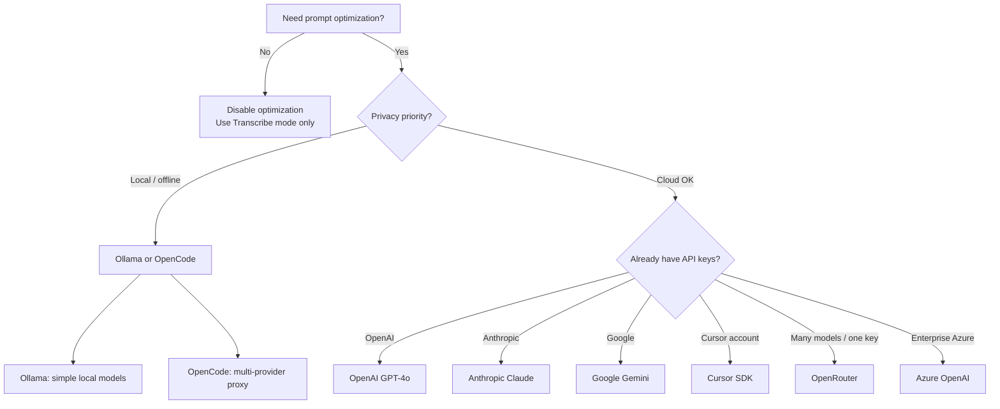

# Provider Selection Guide

Choose the right prompt optimization provider for your workflow. **Whisper transcription always uses OpenAI** regardless of this choice.

---

## Quick Decision Tree

---

## Provider Comparison

| Provider | Cost/Transform* | Speed | Privacy | Quality | Best For |
|----------|-----------------|-------|---------|---------|----------|
| OpenAI GPT-4o | ~$0.01 | Fast | Cloud | High | General use; reuse Whisper key |
| Anthropic Claude | ~$0.01–0.02 | Fast | Cloud | Very High | Complex reasoning |
| Google Gemini | ~$0.001 | Very Fast | Cloud | Good | Cost-sensitive usage |
| Azure OpenAI | Varies | Fast | Private Cloud | High | Enterprise deployments |
| Ollama | Free | Medium | Local | Good | Privacy-first, offline |
| OpenCode | Free | Medium | Local | High | Reuse OpenCode multi-provider setup |
| OpenRouter | Varies | Fast | Cloud | High | 200+ models with one API key |
| Cursor | ~$0.01 | Fast | Cloud | High | Cursor Composer and frontier models |

\*Plus Whisper transcription (~$0.006/min, always OpenAI)

---

## Recommendations by Use Case

### Default / simplest setup
**OpenAI** — Same API key as Whisper, `gpt-4o` default, fast and reliable.

### Best quality for complex prompts
**Anthropic Claude 3.5 Sonnet** — Strong reasoning and structured output.

### Lowest optimization cost
**Google Gemini Flash** — Very fast, low per-request cost.

### Privacy / no cloud LLM for optimization
**Ollama** — Run `llama3.1:8b` or similar locally. Whisper still sends audio to OpenAI.

### Already use OpenCode
**OpenCode** — Route through your existing `opencode-llm-proxy` with `provider/model` identifiers.

### One key, many models
**OpenRouter** — Access OpenAI, Anthropic, Google, and more through a single gateway.

### Cursor ecosystem
**Cursor SDK** — Use Cursor API key and models (`composer-2.5`, etc.) from any editor.

### Enterprise compliance
**Azure OpenAI** — Private cloud deployment with your own Azure resource.

---

## Switching Providers

- API keys are stored per provider (`promptimize.apiKey.{provider}`)
- Switching providers does **not** delete saved keys
- Change provider in the configuration webview or via **Configure Prompt Optimization Provider**
- Run **Test Configuration** after switching

---

**See also:** [Configuration Guide](README.md) · [Configuration Webview Guide](webview-guide.md)
