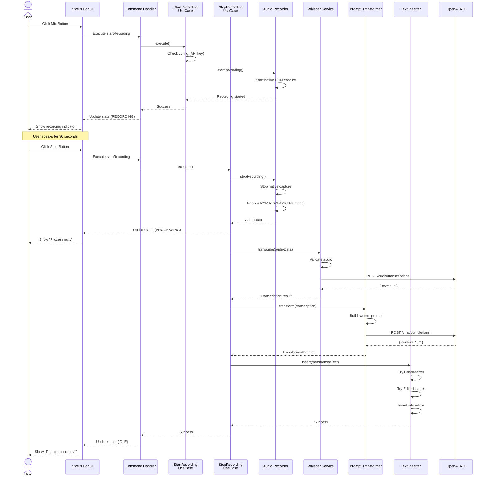
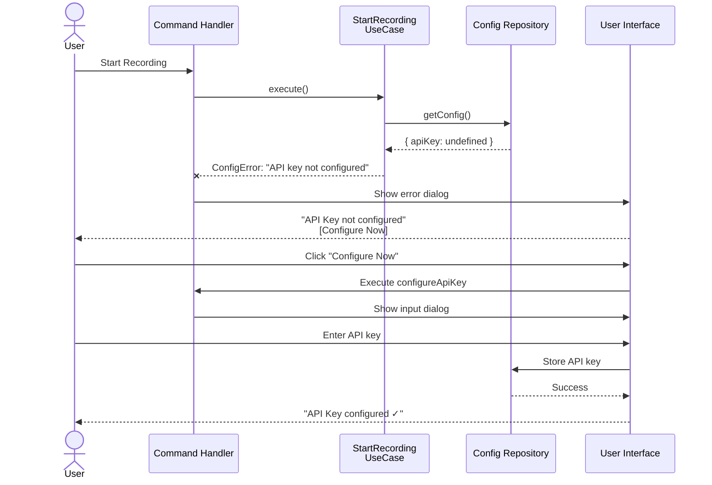
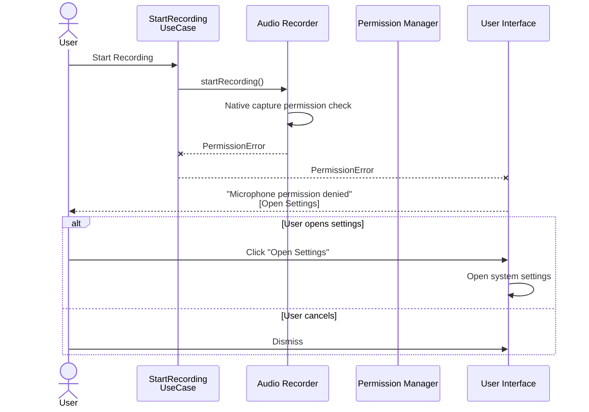
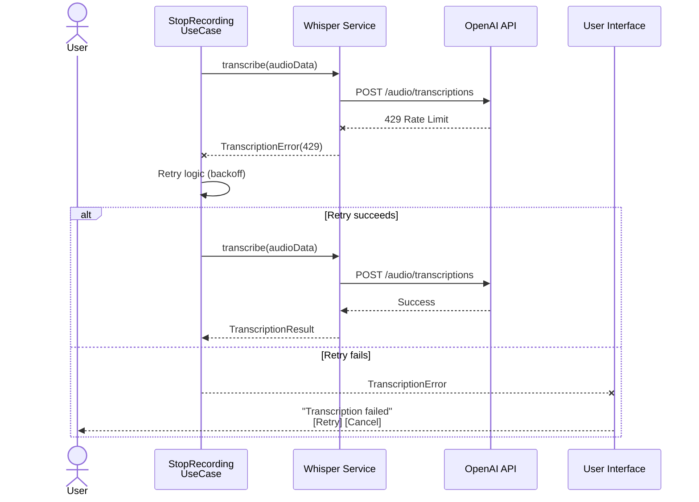
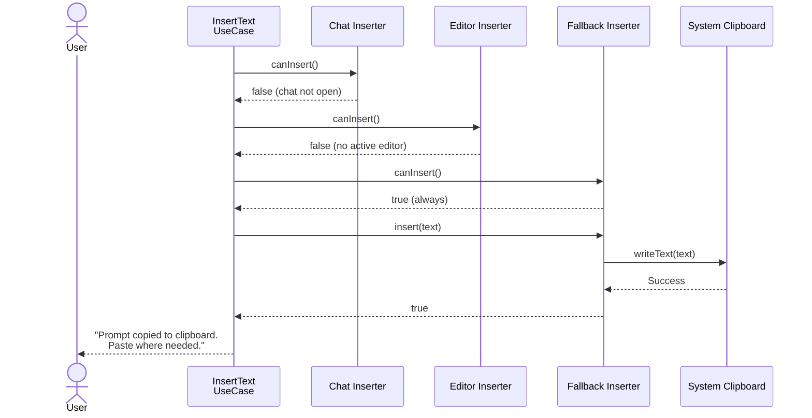
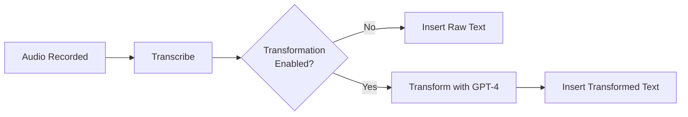
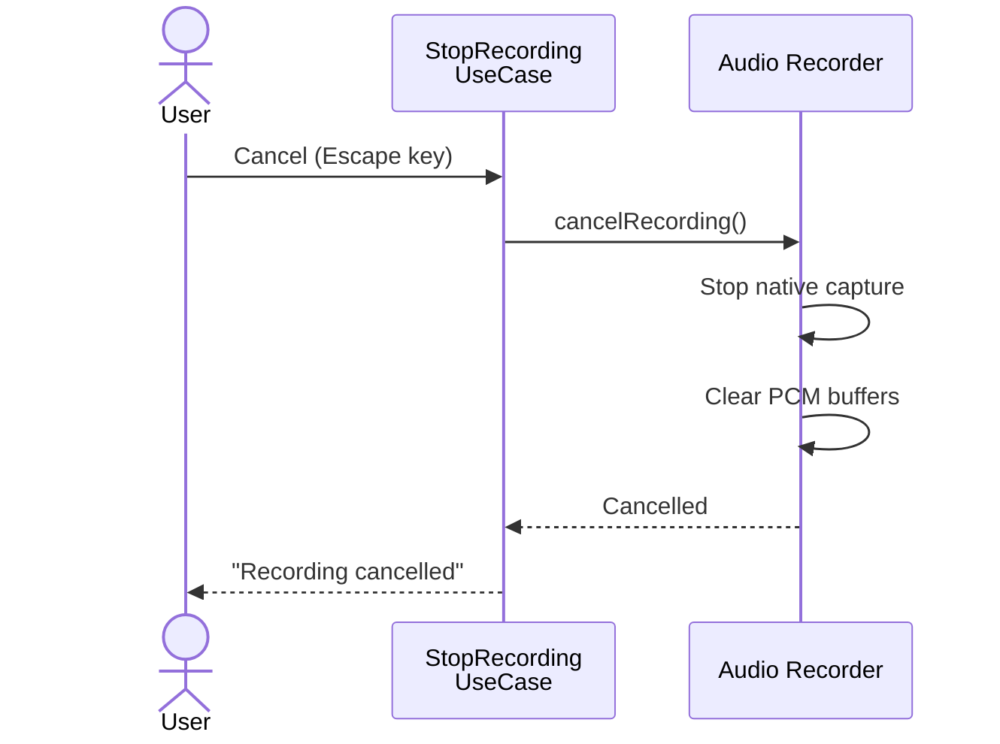
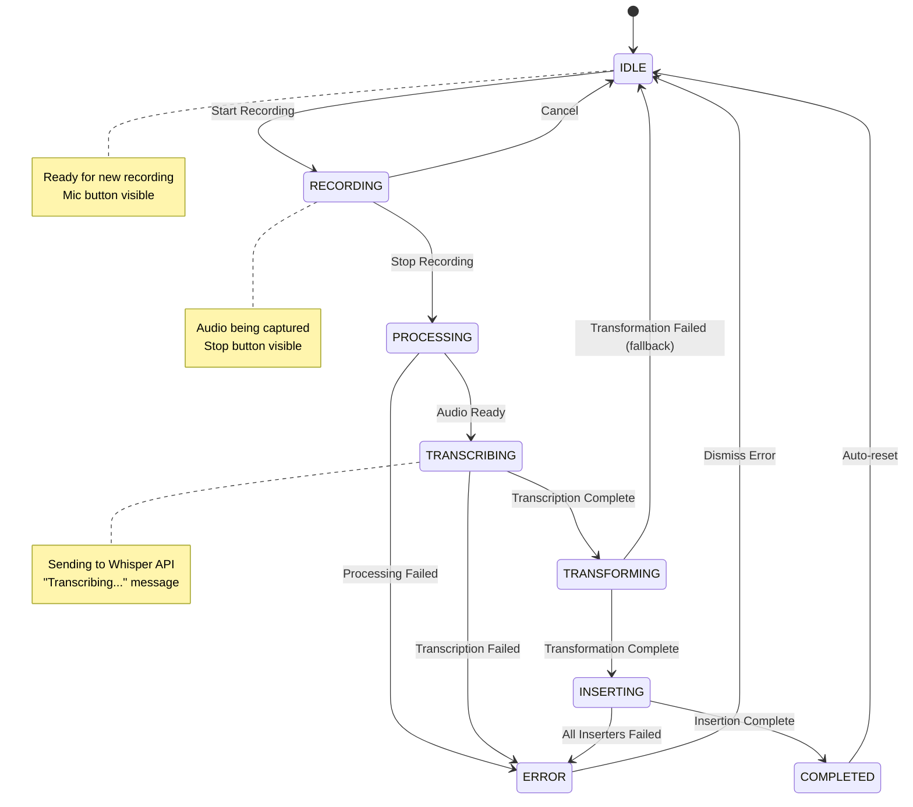
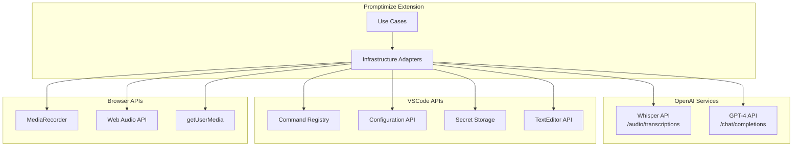

# Complete Workflow Documentation

**Last Updated**: 2026-05-23

---

## Overview

This document details all workflows in Promptimize with sequence diagrams and step-by-step explanations.

---

## 1. Complete Recording Flow (Happy Path)

### Sequence Diagram

### Step-by-Step Explanation

**Phase 1: Start Recording (2-3 seconds)**

1. User clicks microphone button in status bar
2. `StartRecordingCommand` handler invoked
3. `StartRecordingUseCase.execute()` called:
   - Validates API key is configured
   - Calls `audioRecorder.startRecording()`
4. `NativeAudioRecorder` ([ADR-0013](../adr/0013-native-audio-capture.md)):
   - Uses `@kstonekuan/audio-capture` in the extension host
   - Captures 16 kHz mono PCM in memory
   - Surfaces permission errors from the native layer
5. Status bar updates to "Recording..." (red)
6. User sees visual feedback via status bar

**Phase 2: Recording in Progress (0-120 seconds)**

7. PCM chunks collected in extension host memory
8. User speaks naturally about requirements
9. User can cancel at any time (Escape)

**Phase 3: Stop Recording (1-2 seconds)**

10. User clicks stop button or runs stop command
11. `StopRecordingCommand` handler invoked (orchestrates stop → transcribe → transform → insert)
12. `StopRecordingUseCase.execute()` called:
    - Calls `audioRecorder.stopRecording()`
13. `NativeAudioRecorder`:
    - Stops native capture
    - Encodes PCM to WAV format (16 kHz mono)
    - Returns `AudioData` object
14. Status bar updates to "Processing..."

**Phase 4: Transcription (3-8 seconds)**

16. Progress notification shows "Transcribing..."
17. `TranscribeAudioUseCase.execute()` called:
    - Validates audio file size/duration
    - Calls `whisperService.transcribe(audioData)`
18. `OpenAIWhisperService`:
    - Converts Buffer to File object
    - Calls OpenAI Whisper API
    - Waits for response
19. Receives `TranscriptionResult` with text
20. Audio data discarded from memory

**Phase 5: Transformation (2-4 seconds)**

21. Progress notification shows "Optimizing prompt..."
22. `TransformPromptUseCase.execute()` called:
    - Checks if transformation enabled
    - Gathers context (editor language, project type)
    - Calls `promptTransformer.transform(transcription)`
23. `OpenAIPromptTransformer`:
    - Builds system prompt with instructions
    - Calls OpenAI GPT-4 API
    - Waits for structured response
24. Receives `TransformedPrompt` with optimized text

**Phase 6: Insertion (<1 second)**

25. Progress notification shows "Inserting text..."
26. `InsertTextUseCase.execute()` called:
    - Tries `ChatParticipantInserter` first
    - Falls back to `EditorTextInserter`
    - Finally `FallbackTextInserter` (clipboard)
27. Text inserted into active context
28. Status bar returns to "Voice" (idle)
29. Success notification shown

**Total Time**: ~8-15 seconds for typical 30s recording

---

## 2. Error Handling Flows

### Scenario: API Key Not Configured

### Scenario: Microphone Permission Denied

### Scenario: Transcription Fails

### Scenario: Chat Input Not Available (Fallback)

---

## 3. Alternative Flows

### Transcribe vs Promptimize

Two recording modes share the same audio capture and Whisper transcription but differ after transcription:

| Mode | Start | Stop pipeline |
|------|-------|---------------|
| **Transcribe** | `Cmd/Ctrl+Alt+V` or status bar | Stop → Whisper → insert **raw** text |
| **Promptimize** | `Cmd/Ctrl+Alt+P` or status bar | Stop → Whisper → transform → insert **optimized** text |

See [Recording Modes](../user-guide/recording-modes.md).

### Skip Transformation (Direct Transcription)

User can disable prompt transformation in settings:

### Cancel Recording Mid-Session

---

## 4. State Machine

### Recording State Transitions

---

## 5. Integration Points

### External Service Calls

---

## Summary

**Key Flows**:
1. ✅ Complete recording → transcription → transformation → insertion
2. ✅ Error handling with graceful degradation
3. ✅ Multiple insertion strategies with fallbacks
4. ✅ Clear state management with visual feedback
5. ✅ Cancellation at any stage
6. ✅ Configuration-based behavior

**Flow Characteristics**:
- **Fast**: Most operations complete in seconds
- **Resilient**: Multiple fallback strategies
- **User-friendly**: Clear visual feedback at each stage
- **Flexible**: Configurable behavior

---

**Next**: See [UX Documentation](../ux/states.md) for UI details.
