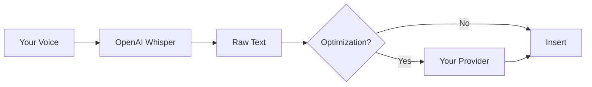

# Transformation Providers

Cursor Whisper uses **two separate AI services**:

1. **Transcription (required)** — Always OpenAI Whisper. Requires an OpenAI API key.
2. **Prompt optimization (optional)** — Your choice of provider below. Requires provider-specific credentials when noted.



## Supported Providers (Optimization Only)

| Provider | API Key Required | Typical Cost | Best For |
|----------|------------------|--------------|----------|
| [OpenAI](openai.md) | Yes (can reuse Whisper key) | ~$0.01/transform | Default; same key as Whisper |
| [Anthropic](anthropic.md) | Yes (Anthropic key) | ~$0.01–0.02/transform | Claude; strong instruction following |
| [Google Gemini](google-gemini.md) | Yes (Google AI key) | ~$0.001/transform | Cost-effective cloud option |
| [Azure OpenAI](azure-openai.md) | Yes (Azure key + endpoint) | Varies | Enterprise Azure deployments |
| [Ollama](ollama.md) | No | Free (local) | Local/offline optimization |

**Whisper transcription:** ~$0.006/min (always OpenAI, always required)

## Quick Setup

1. Run **Cursor Whisper: Setup Wizard** (recommended for first-time users)
2. Or open Command Palette → **Cursor Whisper: Configure Prompt Optimization Provider**
3. Select provider, enter API key or credentials (if required), and choose a model
4. Run **Cursor Whisper: Test Configuration** to verify

## Settings

```json
{
  "cursorWhisper.transformationProvider": "openai",
  "cursorWhisper.enablePromptTransformation": true
}
```

See [Configuration Guide](../configuration/README.md) for the full provider comparison table.

## Switching Providers

API keys are stored per provider. Switching providers does not delete previously saved keys.

Whisper always uses your OpenAI key regardless of which optimization provider is active.

## Cost Comparison (Approximate)

| Provider | Typical Cost per Transformation |
|----------|----------------------------------|
| OpenAI GPT-4o | ~$0.01 |
| Anthropic Claude 3.5 Sonnet | ~$0.01–0.02 |
| Google Gemini 1.5 Flash | ~$0.001 |
| Azure OpenAI | Varies by deployment |
| Ollama | Free (local compute) |

Whisper transcription remains ~$0.006/minute regardless of optimization provider.
