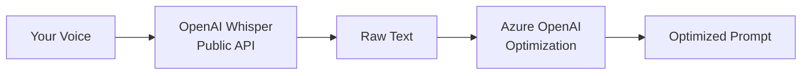

# Azure OpenAI

> **Important:** Voice-to-text transcription **always** uses OpenAI Whisper (public OpenAI API). Azure OpenAI is only used for **prompt optimization**, not transcription.

Use GPT models deployed on Azure OpenAI Service for enterprise prompt optimization.

## How the services connect



## Configuration

```json
{
  "cursorWhisper.transformationProvider": "azure",
  "cursorWhisper.azureEndpoint": "https://my-resource.openai.azure.com",
  "cursorWhisper.azureDeployment": "gpt-4o-deployment"
}
```

## Setup

1. Configure OpenAI API key for Whisper transcription (required)
2. Create an Azure OpenAI resource and deploy a chat model
3. Run **Cursor Whisper: Configure Prompt Optimization Provider**
4. Select **Azure OpenAI**
5. Enter your Azure API key, endpoint URL, and deployment name

## Cost estimate

| Service | Typical cost |
|---------|--------------|
| Whisper transcription (OpenAI public) | ~$0.006/min |
| Azure OpenAI optimization | Varies by deployment and region |

## Notes

- The **deployment name** (not the model name) is used for API calls
- Endpoint should be the resource URL without trailing slash
- Azure API key is stored separately from your OpenAI Whisper key

## Common pitfalls

- **Using Azure for Whisper** — Not supported; Whisper uses public OpenAI API only
- **Wrong deployment name** — Use the deployment name from Azure portal, not the model ID
