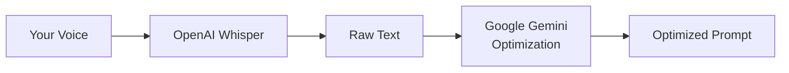

# Google Gemini

> **Important:** Voice-to-text transcription **always** uses OpenAI Whisper. You still need an OpenAI API key for transcription, plus a separate Google AI API key for prompt optimization.

Use Google Gemini models for cost-effective cloud prompt optimization.

## How the services connect



## Configuration

```json
{
  "cursorWhisper.transformationProvider": "google",
  "cursorWhisper.googleModel": "gemini-1.5-pro"
}
```

## Setup

1. Configure OpenAI API key for Whisper (required)
2. Get an API key from [Google AI Studio](https://aistudio.google.com/app/apikey)
3. Run **Cursor Whisper: Configure Prompt Optimization Provider**
4. Select **Google Gemini** and enter your API key

## Cost estimate

| Service | Typical cost |
|---------|--------------|
| Whisper transcription (OpenAI) | ~$0.006/min |
| Gemini 1.5 Flash optimization | ~$0.001/transform |
| Gemini 1.5 Pro optimization | ~$0.005/transform |

## Recommended Models

- `gemini-1.5-pro` — Best quality
- `gemini-1.5-flash` — Fast and inexpensive
- `gemini-2.0-flash` — Latest flash model

## Common pitfalls

- **Missing OpenAI key** — Gemini only handles optimization
- **API key scope** — Use Google AI Studio keys, not GCP service account keys unless configured for Generative Language API
