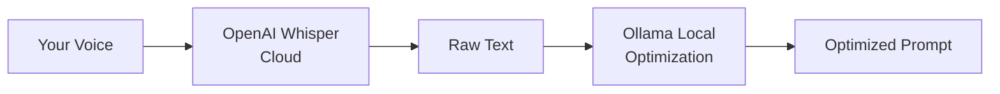

# Ollama (Local)

> **Important:** Voice-to-text transcription **always** uses OpenAI Whisper and requires an OpenAI API key. Ollama only handles **local prompt optimization** — no API key needed for Ollama itself.

Run prompt optimization locally with [Ollama](https://ollama.com/).

## How the services connect



## Configuration

```json
{
  "cursorWhisper.transformationProvider": "ollama",
  "cursorWhisper.ollamaBaseUrl": "http://localhost:11434",
  "cursorWhisper.ollamaModel": "llama3.1:8b"
}
```

## Setup

1. Configure OpenAI API key for Whisper (required)
2. Install Ollama from [ollama.com](https://ollama.com/)
3. Pull a model: `ollama pull llama3.1:8b`
4. Ensure Ollama is running (`ollama serve` or the desktop app)
5. Run **Cursor Whisper: Configure Prompt Optimization Provider** and select **Ollama**

## Cost estimate

| Service | Typical cost |
|---------|--------------|
| Whisper transcription (OpenAI) | ~$0.006/min |
| Ollama optimization | Free (local compute) |

## Recommended Models

- `llama3.1:8b` — Good balance for local use (default)
- `mistral:latest` — Fast, capable
- `codellama:latest` — Code-focused prompts

## Troubleshooting

- **Server not reachable**: Confirm Ollama is running at the configured base URL
- **Model not found**: Run `ollama pull <model-name>`
- **Slow responses**: Use a smaller model or ensure GPU acceleration is available
- **Privacy note**: Whisper still sends audio to OpenAI; only optimization runs locally
