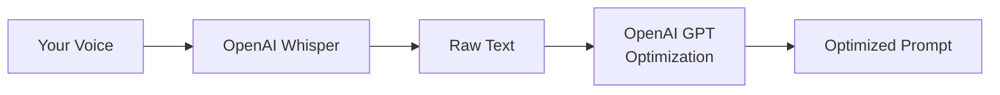

# OpenAI (Default Optimization Provider)

> **Important:** Voice-to-text transcription **always** uses OpenAI Whisper and requires an OpenAI API key, regardless of which optimization provider you choose.

OpenAI is the default **prompt optimization** provider. You can reuse the same API key as Whisper transcription.

## How the services connect



## Configuration

```json
{
  "cursorWhisper.transformationProvider": "openai",
  "cursorWhisper.transformationModel": "gpt-4o"
}
```

## Setup

1. Get an API key from [OpenAI Platform](https://platform.openai.com/api-keys)
2. Run **Cursor Whisper: Setup Wizard** or **Configure OpenAI API Key (Whisper)**
3. Run **Cursor Whisper: Configure Prompt Optimization Provider** and select OpenAI (or reuse the same key)
4. Run **Cursor Whisper: Configure OpenAI Optimization Model** to pick from models on your key

## Cost estimate

| Service | Typical cost |
|---------|--------------|
| Whisper transcription | ~$0.006/min |
| GPT-4o optimization | ~$0.01/transform |

Using OpenAI for both services means **one API key** and **one billing account**.

## Recommended Models

- `gpt-4o` — Best balance of speed and quality (default)
- `gpt-4o-mini` — Lower cost
- `gpt-4-turbo` — Large context window

## Common pitfalls

- **Invalid key format** — Keys must start with `sk-`
- **No credits** — Whisper and GPT share the same OpenAI account balance
- **Confusing keys** — Whisper key is required even if you use Anthropic/Google for optimization
