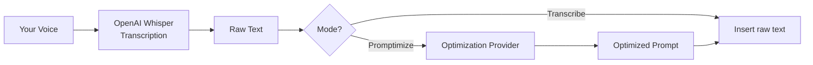

# Quick Start Guide

Get Promptimize running in a few minutes.

---

## What Promptimize Does

Promptimize has **two separate services** and **two recording modes**:

1. **Voice-to-text (required)** — Always uses **OpenAI Whisper**. Requires an **OpenAI API key**.
2. **Prompt optimization (optional)** — Converts transcribed speech into structured prompts. Choose from 8 providers.

| Mode | Shortcut | Pipeline |
|------|----------|----------|
| **Transcribe** | `Cmd/Ctrl+Alt+V` | Record → Whisper → insert raw text |
| **Promptimize** | `Cmd/Ctrl+Alt+P` | Record → Whisper → optimize → insert |

See [Recording Modes](user-guide/recording-modes.md) for when to use each mode.

---

## Installation

### From VSIX (current)

1. Download the latest `.vsix` from [Releases](https://github.com/vypdev/promptimize/releases)
2. Open VSCode or Cursor
3. Extensions → `...` menu → **Install from VSIX...**
4. Select the downloaded file
5. Reload the window if prompted

### From Marketplace (coming soon)

Search for **Promptimize** in the Extensions view.

---

## First-Time Setup

On first launch, Promptimize prompts you to open the **Configuration panel**. You can also open it anytime:

**Command Palette** → `Promptimize: Open Configuration` or click $(gear) **Settings** in the status bar.

### Configuration panel overview

The panel is a single webview (not a multi-step wizard) with these sections:

1. **Transcription** — Enter OpenAI API key, test connection
2. **Prompt Optimization** — Enable/disable, choose provider, enter credentials, pick model
3. **System Prompt** — Customize transformation style (optional)
4. **Provider Comparison** — Compare all 8 providers
5. **Save & Close** — Validates and completes setup

Full details: [Configuration Webview Guide](configuration/webview-guide.md)

### Minimum configuration (transcription only)

1. Open the configuration panel
2. Enter your OpenAI API key → **Test** (optional)
3. Leave **Enable prompt optimization** unchecked
4. Click **Save & Close**

---

## First Recording

### Transcribe (raw text)

1. Open an editor or Cursor chat input
2. Press `Cmd+Alt+V` (macOS) or `Ctrl+Alt+V` (Windows/Linux)
3. Speak clearly
4. Click **Recording...** in the status bar to stop
5. Raw transcription appears in your editor or chat

### Promptimize (optimized prompt)

1. Ensure optimization is enabled in the configuration panel
2. Press `Cmd+Alt+P` (macOS) or `Ctrl+Alt+P` (Windows/Linux)
3. Speak clearly
4. Click **Recording...** in the status bar to stop
5. Optimized prompt appears after Whisper + transformation

**Note:** Keyboard shortcuts start recording only. Stop via the status bar or stop commands.

---

## Configuration Commands

| Command | Purpose |
|---------|---------|
| `Promptimize: Open Configuration` | Configuration webview (primary) |
| `Promptimize: Setup Wizard` | Same as Open Configuration |
| `Promptimize: Configure OpenAI API Key (Whisper)` | Set or update OpenAI key |
| `Promptimize: Configure Prompt Optimization Provider` | Command Palette provider wizard |
| `Promptimize: Configure OpenAI Optimization Model` | Pick GPT model (OpenAI provider) |
| `Promptimize: Test Configuration` | Test setup; opens before/after webview |

---

## Status Bar

Three items in the status bar (right side):

| Indicator | Meaning |
|-----------|---------|
| $(mic) **Transcribe** | Start/stop raw transcription mode |
| $(sparkle) **Promptimize** | Start/stop optimized prompt mode |
| $(gear) **Settings** / $(warning) **Setup** | Open configuration panel |

While recording, the active mode shows **$(record) Recording...** (click to stop).

During processing, notifications show: Transcribing... → Optimizing... → Inserting...

Tooltip when idle: `Transcription: OpenAI Whisper | Optimization: [Provider]`

---

## Test Configuration

Run **Promptimize: Test Configuration** to validate your setup. When optimization is enabled, a webview opens showing:

- Original sample transcription
- Transformed prompt from your provider
- **Improvements** list (filler removal, conciseness, structure)

See [Advanced Settings — Test Configuration](configuration/advanced-settings.md#test-configuration-output).

---

## Troubleshooting

See the full [Troubleshooting Guide](user-guide/troubleshooting.md) with decision trees.

### OpenAI API key errors

- Confirm the key starts with `sk-`
- Check credits at https://platform.openai.com/account/billing
- Run **Test** in the configuration panel or **Test Configuration**

### Optimization provider errors

- Each provider needs its own API key (except Ollama and OpenCode)
- OpenAI for Whisper and OpenAI for optimization can use the **same key**
- Reconfigure via **Open Configuration** panel

### Microphone not working

**macOS:** System Settings → Privacy & Security → Microphone → enable Cursor/VSCode

**Windows:** Settings → Privacy → Microphone → enable Cursor/VSCode

### Text not inserting

- Focus an editor or chat input before recording
- Check status bar for errors
- Text may fall back to clipboard — paste manually

### Need more help?

- [Configuration guide](configuration/README.md)
- [GitHub Issues](https://github.com/vypdev/promptimize/issues)

---

**Next:** [Configuration Guide](configuration/README.md) · [Recording Modes](user-guide/recording-modes.md)
