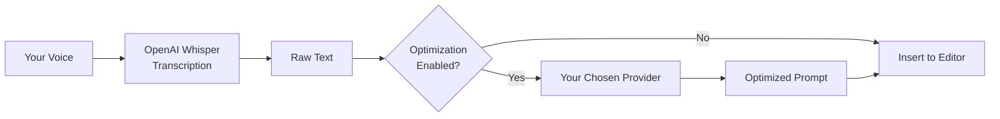

# Quick Start Guide

Get Cursor Whisper running in a few minutes.

---

## What Cursor Whisper Does

Cursor Whisper has **two separate services**:

1. **Voice-to-text (required)** — Always uses **OpenAI Whisper**. Requires an **OpenAI API key**.
2. **Prompt optimization (optional)** — Converts transcribed speech into structured prompts. You choose the provider (OpenAI, Anthropic, Google, Azure, or Ollama) and supply credentials when required.

---

## Installation

### From VSIX (current)

1. Download the latest `.vsix` from [Releases](https://github.com/vypdev/cursor-whisper/releases)
2. Open VSCode or Cursor
3. Extensions → `...` menu → **Install from VSIX...**
4. Select the downloaded file
5. Reload the window if prompted

### From Marketplace (coming soon)

Search for **Cursor Whisper** in the Extensions view.

---

## First-Time Setup

On first launch, Cursor Whisper opens the **Setup Wizard**. You can also run it anytime:

**Command Palette** → `Cursor Whisper: Setup Wizard`

### Wizard steps

1. **Welcome** — Explains transcription vs optimization
2. **OpenAI API key** — Required for Whisper transcription
   - Get a key: https://platform.openai.com/api-keys
3. **Test OpenAI connection** — Verifies your key works
4. **Enable optimization?** — Choose yes or transcription-only mode
5. **Select provider** (if enabled) — OpenAI, Anthropic, Google, Azure, or Ollama
6. **Provider credentials** — Enter API key or endpoint when required
7. **Select model** — Pick the model for optimization
8. **Test optimization** — Optional validation before finishing

### Minimum configuration (transcription only)

If you only need voice-to-text:

1. Run the setup wizard
2. Enter your OpenAI API key
3. Choose **No, transcription only**

---

## First Recording

1. Open an editor or Cursor chat input
2. Press `Cmd+Alt+V` (macOS) or `Ctrl+Alt+V` (Windows/Linux)
3. Speak clearly
4. Press the shortcut again or click the status bar to stop
5. Wait for transcription (and optimization if enabled)
6. Text appears in your editor or chat

---

## Configuration Commands

| Command | Purpose |
|---------|---------|
| `Cursor Whisper: Setup Wizard` | Guided first-time or full reconfiguration |
| `Cursor Whisper: Configure OpenAI API Key (Whisper)` | Set or update OpenAI key for transcription |
| `Cursor Whisper: Configure Prompt Optimization Provider` | Choose provider and credentials |
| `Cursor Whisper: Configure OpenAI Optimization Model` | Pick GPT model when using OpenAI for optimization |
| `Cursor Whisper: Test Configuration` | Verify Whisper + optimization |

---

## Status Bar

| Indicator | Meaning |
|-----------|---------|
| `Setup Whisper` | Setup incomplete — click to run wizard |
| `Voice` | Ready to record |
| `Recording...` | Recording in progress |
| `Transcribing...` | Sending audio to OpenAI Whisper |
| `Optimizing...` | Running prompt optimization |
| Gear icon | Open setup wizard |

Tooltip shows: `Transcription: OpenAI Whisper | Optimization: [Provider]`

---

## Troubleshooting

### OpenAI API key errors

- Confirm the key starts with `sk-`
- Check credits at https://platform.openai.com/account/billing
- Run **Cursor Whisper: Test Configuration**

### Optimization provider errors

- Each provider needs its own API key (except Ollama)
- OpenAI for Whisper and OpenAI for optimization can use the **same key**
- Run **Cursor Whisper: Configure Prompt Optimization Provider**

### Microphone not working

**macOS:** System Settings → Privacy & Security → Microphone → enable Cursor/VSCode

**Windows:** Settings → Privacy → Microphone → enable Cursor/VSCode

### Text not inserting

- Focus an editor or chat input before recording
- Check status bar for errors
- Text may fall back to clipboard — paste manually

### Need more help?

- [Configuration guide](configuration/README.md)
- [GitHub Issues](https://github.com/vypdev/cursor-whisper/issues)

---

**Next:** [Configuration Guide](configuration/README.md)
