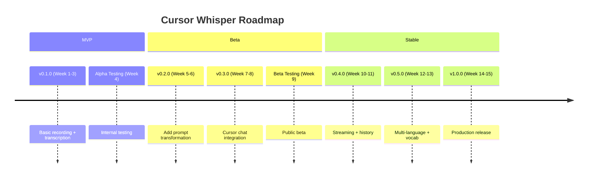

# MVP and Roadmap

**Last Updated**: 2026-05-23

---

## MVP Definition (v0.1.0)

### Scope

**What's IN the MVP**:
- ✅ Audio recording from microphone (webview)
- ✅ Transcription with OpenAI Whisper
- ✅ Insertion into active text editor
- ✅ API key configuration (SecretStorage)
- ✅ Basic visual feedback (status bar)
- ✅ Error handling and notifications
- ✅ Cross-platform support (macOS, Windows, Linux)

**What's OUT of the MVP**:
- ❌ Prompt transformation (GPT-4 optimization) → v0.2.0
- ❌ Chat integration (Cursor chat input) → v0.3.0
- ❌ Real-time streaming transcription → v0.4.0
- ❌ Recording history → v0.4.0
- ❌ Multi-language auto-detection → v0.5.0
- ❌ Custom vocabulary → v0.5.0

### Success Criteria

**MVP is successful if**:
1. ✅ Users can record → transcribe → insert in <30 seconds
2. ✅ Transcription accuracy >90% for clear English speech
3. ✅ Works reliably on all three platforms
4. ✅ No data loss (audio properly processed or error shown)
5. ✅ Zero crashes in normal operation
6. ✅ API key configuration is clear and secure
7. ✅ 10+ users actively using it for 1 week

---

## Release Timeline

---

## Version Roadmap

### v0.1.0 - MVP (Weeks 1-3)

**Goal**: Prove core concept works

**Features**:
- Basic audio recording (16kHz mono)
- OpenAI Whisper transcription
- Insert into active editor
- Status bar UI
- API key configuration
- Error handling

**Technical**:
- Clean Architecture foundation
- Domain/Application/Infrastructure layers
- Unit test coverage >70%
- Basic documentation

**Non-Goals**:
- Prompt optimization
- Chat integration
- Advanced UI

**Release Criteria**:
- ✅ All features working
- ✅ Tests passing
- ✅ No critical bugs
- ✅ Basic documentation complete

---

### v0.2.0 - Prompt Transformation (Weeks 5-6)

**Goal**: Make transcriptions more useful

**New Features**:
- ✅ GPT-4 prompt transformation
- ✅ Structured output (sections)
- ✅ Before/after comparison
- ✅ Toggle transformation on/off

**Improvements**:
- Better error messages
- Faster audio processing
- Improved status indicators

**Technical**:
- `OpenAIPromptTransformer` implementation
- `TransformPromptUseCase`
- Context gathering (editor language, project type)
- Transformation caching (future optimization)

**Release Criteria**:
- ✅ Transformation works >90% of time
- ✅ Clear improvements visible
- ✅ Option to disable
- ✅ Tests for transformation logic

---

### v0.3.0 - Chat Integration (Weeks 7-8)

**Goal**: Seamless Cursor chat integration

**New Features**:
- ✅ Chat Participant API integration
- ✅ Auto-detect chat context
- ✅ Direct insertion into chat input
- ✅ Cursor compatibility warnings

**Improvements**:
- Chain of Responsibility for insertion
- Fallback strategies (chat → editor → clipboard)
- Better state management

**Technical**:
- `ChatParticipantInserter`
- Chat context detection
- Cursor Classic vs Glass detection
- Compatibility checker

**Release Criteria**:
- ✅ Works in Cursor Classic mode
- ✅ Works in Editor Window
- ✅ Graceful fallback in Agents Window
- ✅ Clear user feedback

---

### v0.4.0 - Advanced Features (Weeks 10-11)

**Goal**: Power user features

**New Features**:
- ✅ Real-time streaming transcription
- ✅ Recording history (optional)
- ✅ Edit before insert
- ✅ Push-to-talk mode
- ✅ Customizable shortcuts

**Improvements**:
- Faster transcription start
- Progress indicators
- Better UX polish

**Technical**:
- Streaming audio chunks
- Local storage for history
- Preview modal/panel
- Keyboard shortcut configuration

**Release Criteria**:
- ✅ Streaming works without latency issues
- ✅ History is opt-in and secure
- ✅ All features well-tested

---

### v0.5.0 - Multi-Language (Weeks 12-13)

**Goal**: International support

**New Features**:
- ✅ Auto-detect language
- ✅ Support 10+ languages
- ✅ Custom vocabulary per project
- ✅ Technical term correction
- ✅ Acronym glossary

**Improvements**:
- Better transcription accuracy
- Context-aware hints
- Project-specific settings

**Technical**:
- Language detection
- Vocabulary management
- Per-project configuration
- Whisper prompt optimization

**Release Criteria**:
- ✅ Accurate transcription in 5+ languages
- ✅ Custom vocabulary works
- ✅ Performance not degraded

---

### v1.0.0 - Production Release (Weeks 14-15)

**Goal**: Production-ready, stable, well-documented

**Features** (all previous + polish):
- ✅ All features from v0.1-v0.5
- ✅ Complete documentation
- ✅ Comprehensive testing
- ✅ Performance optimization
- ✅ Accessibility compliance

**Improvements**:
- Final UX polish
- Performance benchmarks met
- All edge cases handled
- Security audit complete

**Technical**:
- 90%+ test coverage
- Zero known critical bugs
- Performance optimization
- Telemetry (optional, opt-in)

**Release Criteria**:
- ✅ 100+ active users
- ✅ <5% error rate
- ✅ <5s average transcription time
- ✅ Full documentation
- ✅ Security audit passed
- ✅ All platforms tested

---

## Post-1.0 Features (Future)

### v1.1+ - Enterprise Features
- Team API key sharing
- Usage analytics dashboard
- Cost tracking and budgets
- Admin controls

### v1.2+ - Advanced AI
- Multiple STT providers (Google, Azure)
- Local Whisper option (privacy)
- Custom transformation styles
- Context from recent code

### v1.3+ - Collaboration
- Share prompt templates
- Team vocabulary
- Prompt library
- Best practices integration

### v2.0+ - Major Evolution
- Voice commands ("Cursor, refactor this")
- Multi-modal (voice + screen context)
- Automated code generation from voice
- Voice-driven debugging

---

## Feature Priority Matrix

### Priority Scoring

| Feature | User Value | Effort | Risk | Priority |
|---------|-----------|--------|------|----------|
| **MVP Features** ||||| 
| Basic Recording | 10 | 5 | 3 | **P0** |
| Whisper Transcription | 10 | 3 | 2 | **P0** |
| Editor Insertion | 10 | 2 | 1 | **P0** |
| API Key Config | 10 | 2 | 1 | **P0** |
| **v0.2 Features** |||||
| Prompt Transformation | 9 | 3 | 2 | **P1** |
| Before/After Preview | 6 | 4 | 1 | **P2** |
| **v0.3 Features** |||||
| Chat Integration | 9 | 6 | 5 | **P1** |
| Fallback Strategies | 8 | 3 | 2 | **P1** |
| **v0.4 Features** |||||
| Streaming | 7 | 8 | 6 | **P2** |
| History | 6 | 4 | 3 | **P2** |
| Edit Before Insert | 7 | 3 | 1 | **P2** |
| **v0.5 Features** |||||
| Multi-Language | 8 | 5 | 3 | **P2** |
| Custom Vocabulary | 7 | 6 | 3 | **P2** |

**Priority Levels**:
- **P0**: Must have for MVP
- **P1**: Critical for beta
- **P2**: Important for v1.0
- **P3**: Nice to have (post-1.0)

---

## Risk Assessment

### High-Risk Items

| Risk | Impact | Probability | Mitigation |
|------|--------|-------------|-----------|
| Cursor Agents Window incompatible | High | High | Detect + warn, fallback to clipboard |
| Whisper API slow/unreliable | High | Medium | Retry logic, error handling, user feedback |
| Audio permission blocked | High | Medium | Clear instructions, platform-specific guides |
| GPT-4 cost too high | Medium | Low | Make optional, cache results |
| Cross-platform audio issues | Medium | Medium | Test early on all platforms |

### Medium-Risk Items

| Risk | Impact | Probability | Mitigation |
|------|--------|-------------|-----------|
| VSCode API changes | Medium | Low | Version lock, test before updating |
| OpenAI rate limiting | Medium | Medium | Backoff strategy, user communication |
| Large audio files | Low | Medium | Duration limits, size validation |

---

## Development Phases

### Phase 1: Foundation (Weeks 1-3)
- ✅ Set up project structure
- ✅ Implement domain layer
- ✅ Implement application ports
- ✅ Basic infrastructure adapters
- ✅ Unit tests

### Phase 2: Integration (Weeks 4-5)
- ✅ Webview audio recording
- ✅ OpenAI Whisper integration
- ✅ Editor insertion
- ✅ Integration tests

### Phase 3: UX & Polish (Week 6)
- ✅ Status bar UI
- ✅ Error handling
- ✅ Notifications
- ✅ Documentation

### Phase 4: Testing & Release (Week 7-8)
- ✅ Manual testing
- ✅ Bug fixes
- ✅ Performance tuning
- ✅ Alpha release

---

## Metrics & Success Indicators

### Technical Metrics

- **Test Coverage**: >80%
- **Build Time**: <30 seconds
- **Extension Size**: <5MB
- **Memory Usage**: <50MB idle
- **Transcription Time**: <10s for 30s audio

### User Metrics

- **Active Users**: 100+ by v1.0
- **Retention**: >50% weekly active
- **Error Rate**: <5%
- **Average Session**: 5+ recordings/week
- **User Satisfaction**: >4/5 stars

### Performance Benchmarks

| Metric | Target | Acceptable | Poor |
|--------|--------|------------|------|
| Recording start | <500ms | <1s | >2s |
| Transcription | <8s | <15s | >30s |
| Transformation | <4s | <8s | >15s |
| Total (30s audio) | <15s | <25s | >45s |

---

## Release Process

### Pre-Release Checklist

- [ ] All tests passing
- [ ] Coverage >80%
- [ ] No linter errors
- [ ] Documentation updated
- [ ] CHANGELOG updated
- [ ] Version bumped
- [ ] Manual testing complete
- [ ] Cross-platform tested
- [ ] Security review done

### Release Steps

1. **Tag release**: `git tag v0.1.0`
2. **Build**: `npm run package`
3. **Test .vsix**: Install and test manually
4. **Publish to VSCode**: `vsce publish`
5. **Publish to Open VSX**: `ovsx publish`
6. **Create GitHub release**: With changelog
7. **Announce**: Twitter, Reddit, Discord

---

## Summary

**Roadmap Overview**:
- 🎯 **MVP (v0.1.0)**: 3 weeks - Basic recording + transcription
- 🚀 **Beta (v0.2-v0.3)**: 4 weeks - Transformation + chat
- ⭐ **Stable (v0.4-v0.5)**: 4 weeks - Advanced features
- 🎉 **v1.0**: Week 15 - Production release

**Total Timeline**: ~15 weeks from start to v1.0

**Key Milestones**:
1. Week 3: MVP release
2. Week 9: Public beta
3. Week 15: v1.0 production

---

**Next**: See [Development Standards](../standards/coding-conventions.md).
