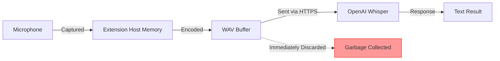

# Security and Privacy

**Last Updated**: 2026-05-23

---

## Overview

Promptimize takes security and privacy seriously. This document outlines our security model, data handling practices, and privacy guarantees.

---

## Data Handling

### Audio Data Lifecycle



**Key Points**:
1. ✅ Audio exists only in memory (RAM)
2. ✅ Never written to disk
3. ✅ Sent over encrypted HTTPS
4. ✅ Immediately discarded after transcription
5. ✅ No recording history
6. ✅ No replay capability

See [ADR-0009: No Persistent Audio Storage](../adr/0009-no-persistent-audio.md) for rationale.

---

## API Key Security

### Storage

**Where keys are stored**:
- ✅ VSCode SecretStorage API
- ✅ Platform-specific secure storage:
  - **macOS**: Keychain
  - **Windows**: Credential Manager
  - **Linux**: Secret Service API (gnome-keyring, kwallet)

**Where keys are NOT stored**:
- ❌ NOT in `settings.json`
- ❌ NOT in plain text files
- ❌ NOT in extension storage
- ❌ NOT in workspace files
- ❌ NOT in git repositories

### Usage

**How keys are used**:
- ✅ Read only when needed
- ✅ Sent only to OpenAI (HTTPS)
- ✅ Never logged (transcriptions and prompts are also excluded from logs)
- ✅ Never displayed (masked in UI)
- ✅ Never sent to telemetry

**Masking**:
```typescript
// API key: sk-abc123...xyz789
// Displayed as: sk-abc1...z789
getMasked(): string {
  return `${key.substring(0, 7)}...${key.substring(key.length - 4)}`;
}
```

See [ADR-0008: VSCode SecretStorage](../adr/0008-secret-storage.md) for implementation.

---

## Data Transmission

### HTTPS Only

All external communication uses HTTPS:
- ✅ OpenAI Whisper API: `https://api.openai.com`
- ✅ OpenAI GPT-4 API: `https://api.openai.com`
- ✅ Certificate validation enforced
- ✅ TLS 1.2 or higher required

### No Third-Party Analytics

- ❌ No Google Analytics
- ❌ No Mixpanel
- ❌ No Sentry
- ❌ No telemetry of any kind

**Data flow**:
```
You → Extension → OpenAI
```

**NOT**:
```
You → Extension → Our Servers → OpenAI ❌
```

---

## OpenAI Data Processing

### What OpenAI Receives

**Whisper API**:
- Audio file (WAV, temporary)
- Language hint (optional)
- Prompt hint (optional)

**GPT-4 API**:
- Transcribed text
- System prompt (instructions)
- Context (editor language, project type)

### OpenAI's Policies

According to OpenAI's [Privacy Policy](https://openai.com/policies/privacy-policy) and [API Data Usage Policy](https://openai.com/policies/usage-policies):

1. **API data NOT used for training**: Data sent via API is not used to train models (as of March 2023)
2. **30-day retention**: API data retained for 30 days for abuse monitoring, then deleted
3. **No human review**: API requests not reviewed by humans (unless flagged for abuse)

**Important**: Users should review OpenAI's policies themselves as they may change.

---

## Microphone Permissions

### Permission Handling

**Request flow**:
1. Extension requests microphone via `getUserMedia()`
2. Browser/OS shows permission dialog
3. User grants or denies
4. Result stored by OS (not by extension)

**Permission scope**:
- ✅ Only when recording
- ✅ Released immediately after recording
- ✅ No background recording
- ✅ User must explicitly start each recording

### Platform-Specific

**macOS**:
- System Settings → Privacy & Security → Microphone
- VSCode/Cursor must be enabled

**Windows**:
- Settings → Privacy → Microphone
- VSCode/Cursor must be enabled

**Linux**:
- Varies by distribution
- Usually handled by browser permission system

---

## Threat Model

### Threats We Mitigate

| Threat | Mitigation |
|--------|-----------|
| **API key theft** | SecretStorage encryption, never logged |
| **API key exposure** | HTTPS only, masked in UI |
| **Audio interception** | HTTPS encryption in transit |
| **Audio exfiltration** | No persistent storage, immediate cleanup |
| **Transcription interception** | HTTPS encryption |
| **Malicious prompt injection** | Input validation, no code execution |
| **Rate limit abuse** | Per-user rate limiting, max duration |

### Threats Outside Our Control

| Threat | Responsibility |
|--------|---------------|
| **Compromised OpenAI** | OpenAI's infrastructure security |
| **OS keychain compromise** | Operating system security |
| **Browser/VSCode compromise** | Electron/VSCode security |
| **Network MITM** | TLS/certificate infrastructure |
| **Physical access** | User's device security |

---

## Privacy Policy

### What We Collect

**Nothing.**

The extension collects ZERO data:
- ❌ No usage statistics
- ❌ No error reports
- ❌ No telemetry
- ❌ No analytics
- ❌ No user identification
- ❌ No tracking

### What OpenAI Collects

When you use the extension, OpenAI receives:
- Your audio recordings (via Whisper API)
- Your transcriptions (via GPT-4 API)
- Your API key (for authentication)
- Your IP address (inherent to HTTP)

**Governed by**: [OpenAI Privacy Policy](https://openai.com/policies/privacy-policy)

### GDPR Compliance

For EU users:
- ✅ No data controller (we don't collect data)
- ✅ Data sent to OpenAI (user consent required)
- ✅ Right to erasure (delete API key from settings)
- ✅ Data portability (transcriptions in plain text)
- ✅ Transparency (this document)

**Important**: Using this extension means sending data to OpenAI (US company). Users should review OpenAI's GDPR compliance.

---

## Security Best Practices

### For Users

**API Key Security**:
1. ✅ Generate a new API key specifically for this extension
2. ✅ Set spending limits in OpenAI dashboard
3. ✅ Rotate keys periodically
4. ✅ Never share your API key
5. ✅ Monitor usage in OpenAI dashboard

**Device Security**:
1. ✅ Keep OS and VSCode updated
2. ✅ Use disk encryption (FileVault, BitLocker)
3. ✅ Lock screen when away
4. ✅ Use strong password/biometric auth

**Recording Privacy**:
1. ✅ Be mindful of what you say
2. ✅ Don't record sensitive passwords/keys
3. ✅ Remember: audio goes to OpenAI
4. ✅ Use in private environment

### For Developers

**Code Security**:
1. ✅ Regular dependency updates
2. ✅ No hardcoded secrets
3. ✅ Input validation everywhere
4. ✅ Error messages don't leak secrets
5. ✅ Code reviews for security issues

**API Usage**:
1. ✅ Always use HTTPS
2. ✅ Validate SSL certificates
3. ✅ Timeout all requests
4. ✅ Rate limit protection
5. ✅ Never log API keys

---

## Incident Response

### If API Key Compromised

**Immediate actions**:
1. Revoke compromised key in [OpenAI dashboard](https://platform.openai.com/api-keys)
2. Generate new API key
3. Update key in Promptimize settings
4. Review OpenAI usage logs for unauthorized activity
5. Consider reporting to OpenAI if abuse detected

### If Security Vulnerability Found

**Responsible Disclosure**:
1. Email: security@cursor-whisper.dev (create)
2. Include: Description, reproduction steps, impact
3. We commit to: Response within 48 hours
4. We commit to: Fix within 7 days for critical issues
5. Public disclosure: After fix is released

---

## Security Checklist

### Pre-Release Security Review

- [ ] All dependencies scanned for vulnerabilities
- [ ] No secrets in code or git history
- [ ] API keys stored in SecretStorage only
- [ ] All external calls use HTTPS
- [ ] Input validation on all user input
- [ ] Error messages don't leak secrets
- [ ] No audio written to disk
- [ ] Memory cleanup verified
- [ ] Permission handling tested
- [ ] OWASP Top 10 reviewed

---

## Compliance

### Licenses

- **Code**: MIT License (permissive)
- **Dependencies**: Compatible open-source licenses
- **No proprietary code**

### Export Compliance

- No encryption beyond standard HTTPS
- No export restrictions
- Open source, freely distributable

---

## Transparency

### Open Source

- ✅ Full source code on GitHub
- ✅ All dependencies visible
- ✅ Build process transparent
- ✅ No obfuscation
- ✅ Community auditable

### Changes

This security document is versioned and changes are:
- Announced in release notes
- Visible in git history
- Subject to user review

---

## Summary

**Privacy Guarantees**:
1. ✅ No telemetry or analytics
2. ✅ Audio never persisted
3. ✅ API keys stored securely
4. ✅ All communication encrypted
5. ✅ No data collection by extension
6. ✅ Open source and auditable

**User Responsibilities**:
1. ⚠️ Understand data goes to OpenAI
2. ⚠️ Protect API key
3. ⚠️ Keep software updated
4. ⚠️ Use in trusted environment

---

**Next**: See [ADR-0009: No Persistent Audio Storage](../adr/0009-no-persistent-audio.md).
