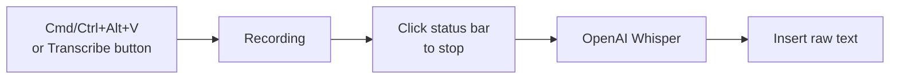
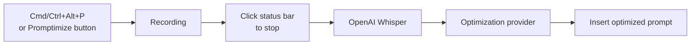

# Recording Modes

Cursor Whisper provides **two distinct recording modes**. Each mode uses the same microphone capture and OpenAI Whisper transcription, but differs in what happens after transcription and which keyboard shortcut starts recording.

---

## Transcribe vs Promptimize

| | **Transcribe** | **Promptimize** |
|---|----------------|-----------------|
| **Purpose** | Voice-to-text only | Voice → optimized prompt |
| **Start shortcut** | `Cmd+Alt+V` / `Ctrl+Alt+V` | `Cmd+Alt+P` / `Ctrl+Alt+P` |
| **Status bar** | $(mic) Transcribe | $(sparkle) Promptimize |
| **Pipeline** | Record → Whisper → insert raw text | Record → Whisper → optimize → insert |
| **Requires optimization** | No | Yes (`enablePromptTransformation`) |
| **API cost** | Whisper only (~$0.006/min) | Whisper + optimization provider |

---

## When to Use Each Mode

### Use Transcribe when you want:

- Raw speech-to-text with minimal processing
- Exact wording preserved (meeting notes, quotes, dictation)
- Lower cost (no optimization API call)
- Quick capture without LLM rewrite

### Use Promptimize when you want:

- Structured prompts for AI coding assistants
- Filler words removed and intent clarified
- Technical requirements organized into sections
- The extension's primary "voice → optimized prompt" workflow

---

## Workflows

### Transcribe mode

### Promptimize mode

---

## Starting and Stopping

### Start recording

| Action | Transcribe | Promptimize |
|--------|------------|-------------|
| Keyboard | `Cmd/Ctrl+Alt+V` | `Cmd/Ctrl+Alt+P` |
| Status bar | Click **Transcribe** | Click **Promptimize** |
| Command Palette | `Cursor Whisper: Start Transcribe Recording` | `Cursor Whisper: Start Promptimize Recording` |

**Note:** Keyboard shortcuts **start** recording only. They do not stop recording.

### Stop recording

- Click the active mode's status bar item while it shows **Recording...**
- Run `Cursor Whisper: Stop Transcribe Recording` or `Cursor Whisper: Stop Promptimize Recording` from the Command Palette

### Cancel recording

- Press `Escape` while recording (discards audio without transcribing)
- Run `Cursor Whisper: Cancel Recording` from the Command Palette

---

## Status Bar During Recording

While recording, the active mode shows **$(record) Recording...** (click to stop). The other mode is disabled until recording finishes or is cancelled.

| Idle state | Recording state |
|------------|-----------------|
| $(mic) Transcribe | $(record) Recording... (Transcribe active) |
| $(sparkle) Promptimize | $(record) Recording... (Promptimize active) |
| $(gear) Settings | Settings remains available |

Tooltip when idle: `Transcription: OpenAI Whisper | Optimization: [Provider]`

---

## Configuration Requirements

| Mode | OpenAI API key (Whisper) | Optimization enabled | Provider credentials |
|------|--------------------------|----------------------|----------------------|
| Transcribe | Required | Not required | Not required |
| Promptimize | Required | Required | Required when provider needs API key |

If Promptimize is disabled in settings, the Promptimize button shows a warning and opens configuration when clicked.

---

## Deprecated Commands

These legacy commands still work but are superseded by mode-specific commands:

| Deprecated | Use instead |
|------------|-------------|
| `Cursor Whisper: (Deprecated) Start Recording` | Start Transcribe or Start Promptimize |
| `Cursor Whisper: (Deprecated) Stop Recording` | Stop Transcribe or Stop Promptimize (routes by active session) |

---

**See also:** [Keyboard Shortcuts](keyboard-shortcuts.md) · [Quick Start](../quickstart.md) · [Configuration Guide](../configuration/README.md)
