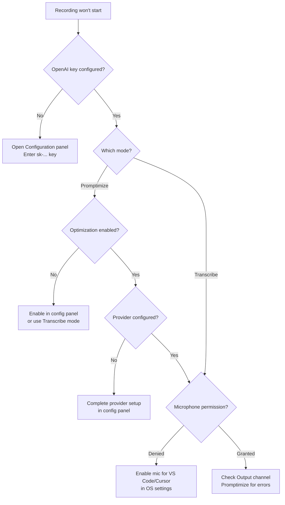
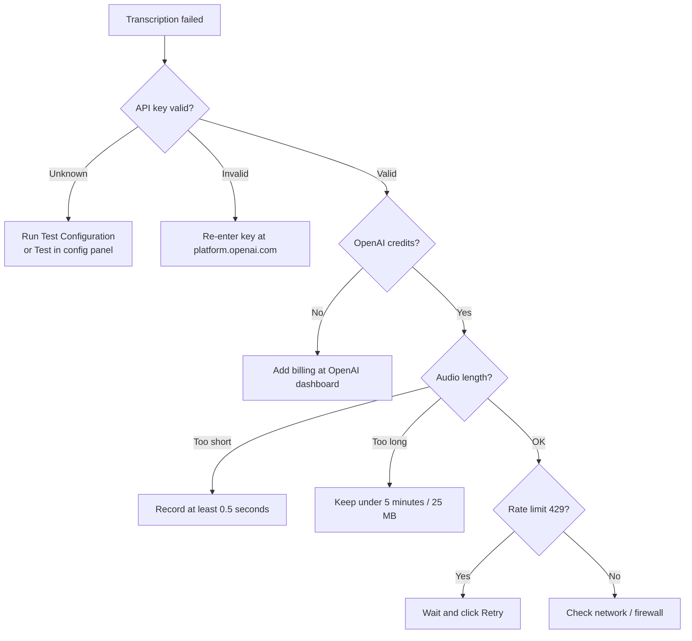
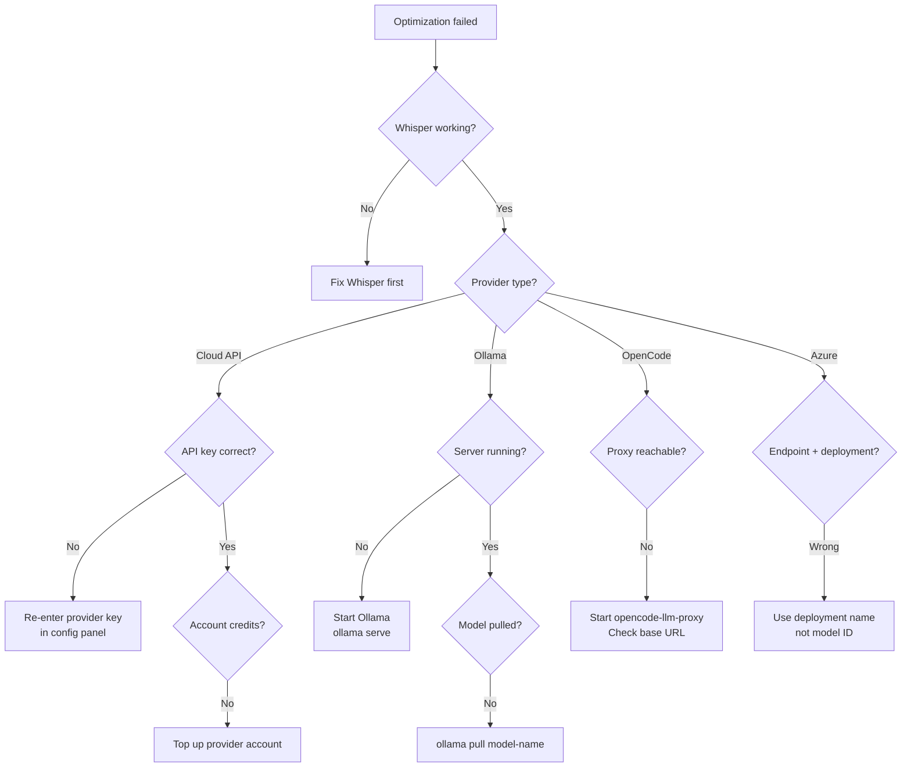
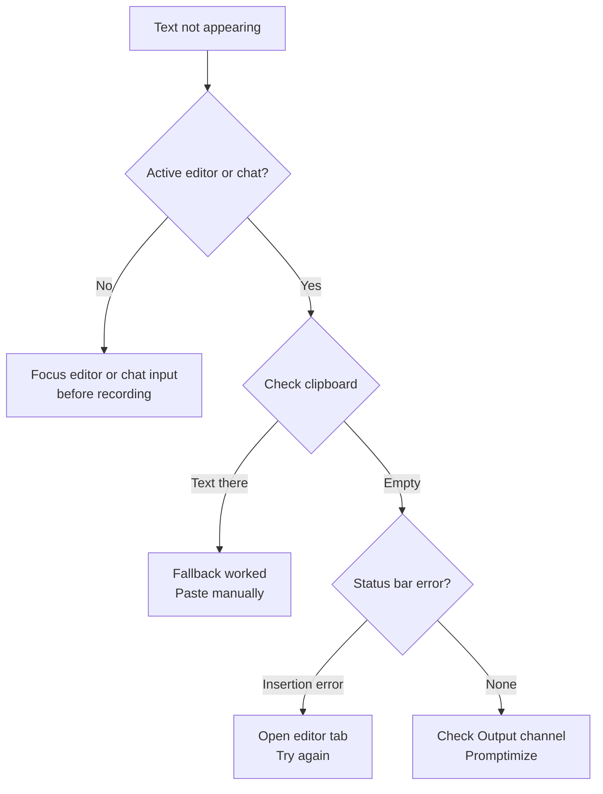

# Troubleshooting

Decision trees and fixes for common Promptimize issues.

---

## Recording Won't Start

### Quick checks

1. Status bar shows $(warning) **Setup** → click to open configuration
2. **Transcribe** requires OpenAI key only
3. **Promptimize** requires OpenAI key + optimization enabled + provider credentials

---

## Transcription Fails

### Error actions

- Transcription errors show a **Retry** button in the notification
- Verify key starts with `sk-`
- Check credits: https://platform.openai.com/account/billing

---

## Optimization Fails (Promptimize)

**Note:** If optimization fails during recording, the extension **falls back to raw transcription** and still inserts text. You may not see an optimization error if insertion succeeds.

---

## Text Not Inserting

### Insertion priority

1. **Cursor chat** — `composer.focusComposer` + paste
2. **VS Code chat** — `workbench.action.chat.open` with query
3. **Active editor** — Insert at cursor
4. **Clipboard fallback** — Copies text + shows notification

---

## Microphone Not Working

| Platform | Fix |
|----------|-----|
| **macOS** | System Settings → Privacy & Security → Microphone → enable Cursor/VS Code |
| **Windows** | Settings → Privacy → Microphone → enable Cursor/VS Code |
| **Linux** | Usually automatic; check `pavucontrol` if using PulseAudio |

Restart the editor after granting permission.

---

## Escape Doesn't Cancel

`Escape` cancels recording only while actively recording (`promptimize.isRecording` context).

If Escape doesn't work:

1. Click the status bar **Recording...** item and use **Cancel Recording** from Command Palette
2. Reload the window after updating the extension

---

## Deprecated Commands

If scripts or keybindings use old commands:

| Old | New |
|-----|-----|
| `promptimize.startRecording` | `startTranscribeRecording` or `startPromptimizeRecording` |
| `promptimize.stopRecording` | `stopTranscribeRecording` or `stopPromptimizeRecording` |

---

## API Key Migration (Upgrading)

The extension migrates legacy secret storage keys automatically:

| Legacy key | Current key |
|------------|-------------|
| `openai-api-key` | `promptimize.apiKey.openai` |
| `promptimize.openai.apiKey` | `promptimize.apiKey.openai` |

If keys seem missing after upgrade, re-enter via **Open Configuration** panel.

---

## Settings Not Taking Effect

| Setting | Status |
|---------|--------|
| `transcriptionLanguage` | ✅ Applied |
| `transcriptionHint` | ✅ Applied |
| `transformationSystemPrompt` | ✅ Applied |
| `audioQuality` | ⏳ Planned — not applied yet |
| `maxRecordingDuration` | ⏳ Planned — not applied yet |
| `showNotifications` | ⏳ Planned — not applied yet |

See [Advanced Settings](configuration/advanced-settings.md#planned-settings-not-yet-applied).

---

## Cursor-Specific Issues

Promptimize works in:

- **Classic Mode** (`cursor --classic`)
- **Editor Window**
- **VS Code / VSCodium**

For chat insertion in Cursor, focus the Composer input before stopping recording.

---

## Getting More Help

- [Configuration Guide](configuration/README.md)
- [Configuration Webview Guide](configuration/webview-guide.md)
- [GitHub Issues](https://github.com/vypdev/cursor-whisper/issues)

Enable the **Promptimize** output channel for operational logs (timestamps, durations, error types). Transcriptions and optimized prompts are **never** written to logs.
