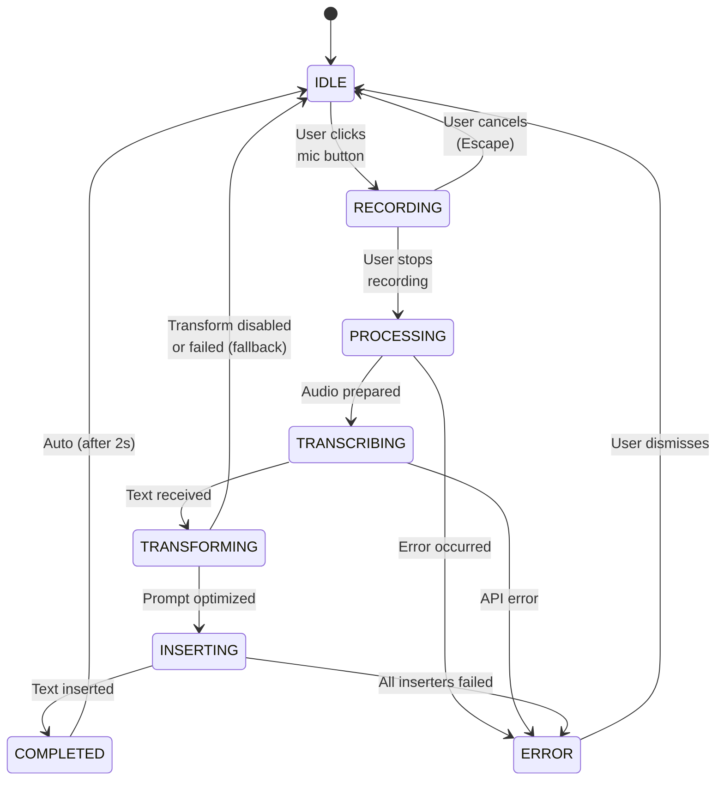

# UX States and Transitions

**Last Updated**: 2026-05-23

---

## Recording States

> **MVP implementation**: The status bar currently reflects states emitted by `NativeAudioRecorder`: `IDLE`, `RECORDING`, `PROCESSING`, `ERROR`, and `CANCELLED`. Fine-grained states (`TRANSCRIBING`, `TRANSFORMING`, `INSERTING`) are shown via the progress notification during stop/processing, not on the status bar. The table below documents the full target UX.

### State Definitions

| State | Description | Visual Indicator | User Actions |
|-------|-------------|------------------|--------------|
| **IDLE** | Ready to record | 🎤 Voice (gray) | Can start recording |
| **RECORDING** | Actively recording | 🔴 Recording... (red, pulsing) | Can stop or cancel |
| **PROCESSING** | Preparing audio | ⏳ Processing... (spinner) | Wait |
| **TRANSCRIBING** | Sending to Whisper | ⏳ Transcribing... (spinner) | Wait |
| **TRANSFORMING** | Optimizing with GPT-4 | ⏳ Optimizing... (spinner) | Wait |
| **INSERTING** | Inserting text | ⏳ Inserting... | Wait |
| **COMPLETED** | Successfully done | ✓ Inserted (green, brief) | Auto-returns to IDLE |
| **ERROR** | Something failed | ❌ Error (red) | Can retry or dismiss |

### State Transition Diagram



### Timing Expectations

| Transition | Expected Duration | User Feedback |
|------------|-------------------|---------------|
| IDLE → RECORDING | <1s | Immediate visual change |
| RECORDING → PROCESSING | <2s | Audio capture complete |
| PROCESSING → TRANSCRIBING | <1s | Preparing upload |
| TRANSCRIBING → TRANSFORMING | 3-8s | "Transcribing..." shown |
| TRANSFORMING → INSERTING | 2-4s | "Optimizing..." shown |
| INSERTING → COMPLETED | <1s | "Inserted ✓" shown |
| COMPLETED → IDLE | 2s auto | Success message visible |

---

## Visual Design

### Status Bar Item

**Idle State**:
```
┌────────────┐
│ 🎤 Voice   │  ← Clickable, gray
└────────────┘
```

**Recording State**:
```
┌──────────────────────┐
│ 🔴 Recording... 0:15 │  ← Red background, pulsing, timer
└──────────────────────┘
```

**Processing States**:
```
┌─────────────────────────┐
│ ⏳ Transcribing... 45%  │  ← Spinner, progress if available
└─────────────────────────┘
```

**Success State** (brief):
```
┌────────────────┐
│ ✓ Inserted     │  ← Green, 2 seconds
└────────────────┘
```

**Error State**:
```
┌────────────────┐
│ ❌ Error       │  ← Red, clickable for details
└────────────────┘
```

## Keyboard Shortcuts

| Shortcut | Action | Context |
|----------|--------|---------|
| `Cmd/Ctrl + Alt + V` | Toggle recording | Global |
| `Escape` | Cancel recording | While recording |
| `Enter` | Stop recording | While recording |

### Push-to-Talk Mode (Future)

Hold `Cmd/Ctrl + Alt + V` to record, release to stop:
- Press: Start recording
- Hold: Keep recording
- Release: Stop and process

---

## Notifications

### Success Notifications

**Minimal** (default):
```
✓ Prompt inserted
```

**Detailed** (optional setting):
```
✓ Prompt inserted successfully
  Original: 145 characters
  Optimized: 98 characters
  Improvements: 3
```

### Error Notifications

**Interactive**:
```
❌ Transcription failed
   OpenAI API error (429: Rate limit)
   [Retry] [Cancel]
```

**With Instructions**:
```
❌ Microphone permission denied
   Please enable microphone access in System Settings
   [Open Settings] [Learn More]
```

### Info Notifications

**Configuration Needed**:
```
ℹ️ API Key not configured
   Cursor Whisper needs an OpenAI API key
   [Configure Now] [Learn More]
```

---

## Accessibility

### Screen Reader Support

All states announced clearly:
- "Voice recording ready"
- "Recording audio, 15 seconds"
- "Transcribing audio, please wait"
- "Prompt inserted successfully"
- "Error: Transcription failed"

### Keyboard Navigation

- All commands accessible via keyboard
- No mouse-only interactions
- Clear focus indicators
- Logical tab order

### Visual Accessibility

- High contrast mode support
- Color not sole indicator (icons + text)
- Minimum text size 12px
- WCAG 2.1 AA compliant

---

## Error Messages

### User-Friendly Error Messages

❌ **Bad**:
```
Error: ECONNREFUSED 401
```

✅ **Good**:
```
Could not connect to OpenAI API
Your API key may be invalid or expired.
[Check API Key] [Help]
```

### Error Categories

**Configuration Errors**:
- "API key not configured"
- "Invalid API key format"
- "API key has expired"

**Permission Errors**:
- "Microphone permission denied"
- "Please enable microphone in System Settings"

**Network Errors**:
- "Could not connect to OpenAI"
- "Request timed out, please try again"
- "Rate limit exceeded, please wait"

**Audio Errors**:
- "Recording failed to start"
- "Audio file too large (max 25MB)"
- "Audio duration too short (min 0.1s)"

**Insertion Errors**:
- "Could not insert text automatically"
- "Prompt copied to clipboard instead"

---

## Performance Targets

### Response Times

| Action | Target | Acceptable | Poor |
|--------|--------|------------|------|
| Start recording | <500ms | <1s | >2s |
| Stop recording | <1s | <2s | >3s |
| Transcription | <8s | <15s | >30s |
| Transformation | <4s | <8s | >15s |
| Insertion | <500ms | <1s | >2s |
| **Total (30s audio)** | **<15s** | **<25s** | **>45s** |

### Perceived Performance

- Immediate visual feedback (<100ms)
- Progress indicators for long operations
- Optimistic UI updates
- Smooth animations (60fps)

---

## Edge Cases

### Very Short Recording (<1s)

```
⚠️ Recording too short (0.4s)
   Minimum duration is 0.5 seconds
   [Try Again]
```

### Very Long Recording (>120s)

```
⚠️ Approaching maximum duration
   Recording will auto-stop at 2:00
   (Current: 1:50)
```

### No Active Editor

Falls back to clipboard:
```
ℹ️ No active editor found
   Prompt copied to clipboard
   Paste it where you need it
```

### Transformation Disabled

```
ℹ️ Transcribed (transformation disabled)
   Raw transcription inserted
   Enable transformation in settings
```

---

## User Preferences

### Configurable Behavior

Users can configure:
- Enable/disable notifications
- Enable/disable prompt transformation
- Maximum recording duration
- Audio quality
- Transcription language
- Keyboard shortcuts

### Settings UI

```
Cursor Whisper Settings

🎤 Recording
  ✓ Show recording indicator
  ✓ Show duration timer
  Maximum duration: [120] seconds

🔤 Transcription
  Language: [Auto-detect ▾]
  ✓ Technical vocabulary hints

✨ Transformation
  ✓ Optimize prompts with AI
  Style: [Technical ▾]
  ✓ Show before/after preview

📝 Insertion
  Priority: [Chat > Editor > Clipboard]
  ✓ Show success notifications

⌨️ Shortcuts
  Toggle recording: [Cmd+Alt+V]
  ✓ Enable push-to-talk mode
```

---

## Summary

**UX Principles**:
1. ✅ **Immediate feedback**: Visual changes <100ms
2. ✅ **Clear states**: Always know what's happening
3. ✅ **Graceful errors**: User-friendly messages with actions
4. ✅ **Minimal friction**: One-click recording
5. ✅ **Smart defaults**: Works great out of the box
6. ✅ **Accessibility**: Works for everyone

**Design Philosophy**:
- **Fast**: Optimized for speed
- **Clear**: No ambiguity about state
- **Forgiving**: Easy to cancel/retry
- **Professional**: Fits VSCode aesthetic

---

**Next**: See [Security Documentation](../security/privacy.md).
