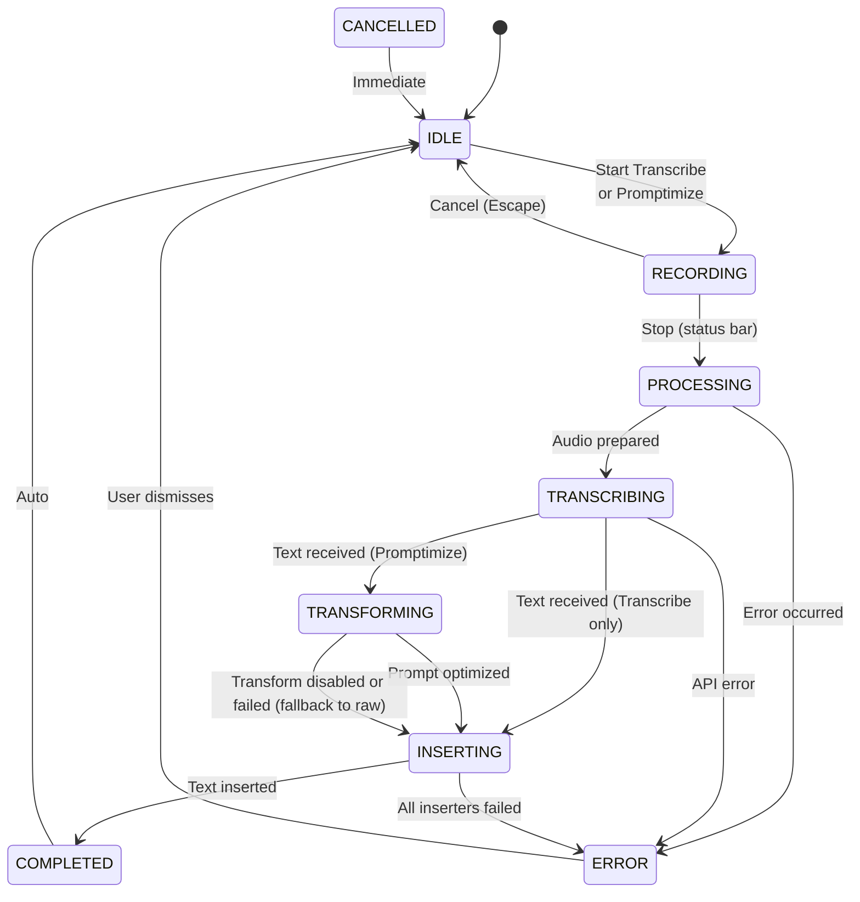

# UX States and Transitions

**Last Updated**: 2026-05-24

---

## Recording States

The status bar reflects states emitted by `NativeAudioRecorder`: `IDLE`, `RECORDING`, `PROCESSING`, `ERROR`, and `CANCELLED`. Fine-grained states (`TRANSCRIBING`, `TRANSFORMING`, `INSERTING`, `COMPLETED`) are shown via **progress notifications** during stop/processing, not on the status bar. This is the current design, not a temporary MVP limitation.

### State Definitions

| State | Status bar | Notification | Description | User Actions |
|-------|------------|--------------|-------------|--------------|
| **IDLE** | $(mic) Transcribe / $(sparkle) Promptimize | — | Ready to record | Start either mode |
| **RECORDING** | $(record) Recording... | — | Actively recording | Click status bar to stop; Escape to cancel |
| **PROCESSING** | $(sync~spin) Processing... | May show progress | Audio captured, preparing | Wait |
| **TRANSCRIBING** | — | "Transcribing..." | Sending to Whisper | Wait |
| **TRANSFORMING** | — | "Optimizing..." | Running optimization (Promptimize) | Wait |
| **INSERTING** | — | "Inserting..." | Inserting text | Wait |
| **COMPLETED** | Returns to IDLE | Success toast | Done | — |
| **ERROR** | Error styling | Error toast | Something failed | Retry or dismiss |
| **CANCELLED** | Returns to IDLE | "Recording cancelled" | User cancelled | — |

### State Transition Diagram



### Timing Expectations

| Transition | Expected Duration | User Feedback |
|------------|-------------------|---------------|
| IDLE → RECORDING | <1s | Status bar changes immediately |
| RECORDING → PROCESSING | <2s | Status bar shows Processing |
| PROCESSING → TRANSCRIBING | <1s | Notification: "Transcribing..." |
| TRANSCRIBING → TRANSFORMING | 3-8s | Notification: "Optimizing..." |
| TRANSFORMING → INSERTING | 2-4s | Notification: "Inserting..." |
| INSERTING → COMPLETED | <1s | Success toast |
| COMPLETED → IDLE | Immediate | Status bar returns to idle |

---

## Visual Design

### Status Bar Items

Three items appear right-aligned:

**Idle:**
```
$(mic) Transcribe    $(sparkle) Promptimize    $(gear) Settings
```

**Recording (Transcribe active):**
```
$(record) Recording...    $(sparkle) Promptimize (disabled)    $(gear) Settings
```

**Processing:**
```
$(sync~spin) Processing...    (both modes disabled)
```

---

## Keyboard Shortcuts

| Shortcut | Action | Context |
|----------|--------|---------|
| `Cmd/Ctrl + Alt + V` | Start Transcribe recording | Global |
| `Cmd/Ctrl + Alt + P` | Start Promptimize recording | Global |
| `Escape` | Cancel recording | While `cursorWhisper.isRecording` |

**Note:** Start shortcuts do **not** stop recording. Stop by clicking the status bar **Recording...** item.

See [Keyboard Shortcuts](../user-guide/keyboard-shortcuts.md) for the full command reference.

### Push-to-Talk Mode (Future)

Hold `Cmd/Ctrl + Alt + V` to record, release to stop — planned for a future release.

---

## Notifications

### Success Notifications

**Default:**
```
✓ Transcription inserted
✓ Optimized prompt inserted
```

### Error Notifications

**Interactive (transcription):**
```
❌ Transcription failed
   [Retry] [Cancel]
```

**With Instructions:**
```
❌ Microphone permission denied
   Please enable microphone access in System Settings
```

### Info Notifications

**Configuration Needed:**
```
ℹ️ OpenAI API key required for transcription
   [Open Configuration]
```

### Planned: Detailed Notifications

When `showNotifications` setting is implemented, optional detailed success messages may include character counts and improvement counts.

---

## Accessibility

### Screen Reader Support

States should be announced clearly via status bar text and notifications.

### Keyboard Navigation

- All commands accessible via Command Palette
- Escape cancels active recording
- No mouse-only interactions required for core workflow

---

## Error Messages

See [Troubleshooting](../user-guide/troubleshooting.md) for decision trees.

### Error Categories

**Configuration:** API key not configured, invalid format, provider incomplete

**Permission:** Microphone permission denied

**Network:** Connection failed, timeout, rate limit (429)

**Audio:** Recording failed, file too large (>25 MB), too short (<0.1s)

**Insertion:** All inserters failed; clipboard fallback used

---

## Edge Cases

### Very Short Recording (<1s)

Whisper rejects audio shorter than 0.1s. User sees transcription error with Retry option.

### Very Long Recording

`maxRecordingDuration` setting is **planned but not yet applied**. Recording continues until manually stopped.

### No Active Editor

Falls back to clipboard:
```
ℹ️ Prompt copied to clipboard
   Paste it where you need it
```

### Transformation Disabled or Failed

Raw transcription is inserted. Optimization failure does not block insertion.

---

## User Preferences

### Configurable in VS Code Settings

- `enablePromptTransformation` — Enable/disable optimization
- `transcriptionLanguage` — Whisper language
- `transcriptionHint` — Whisper vocabulary hint
- `transformationSystemPrompt` — Custom transformation instructions
- `transformationProvider` and provider-specific model settings

### Configurable in Configuration Webview

- OpenAI API key, provider selection, model, system prompt
- See [Configuration Webview Guide](../configuration/webview-guide.md)

### Planned (not yet applied)

- `audioQuality`, `maxRecordingDuration`, `showNotifications`

---

**Next:** [Security Documentation](../security/privacy.md) · [Recording Modes](../user-guide/recording-modes.md)
